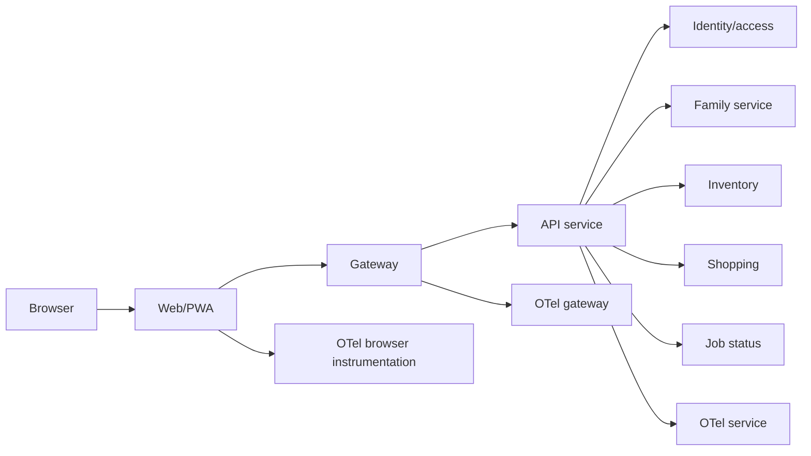
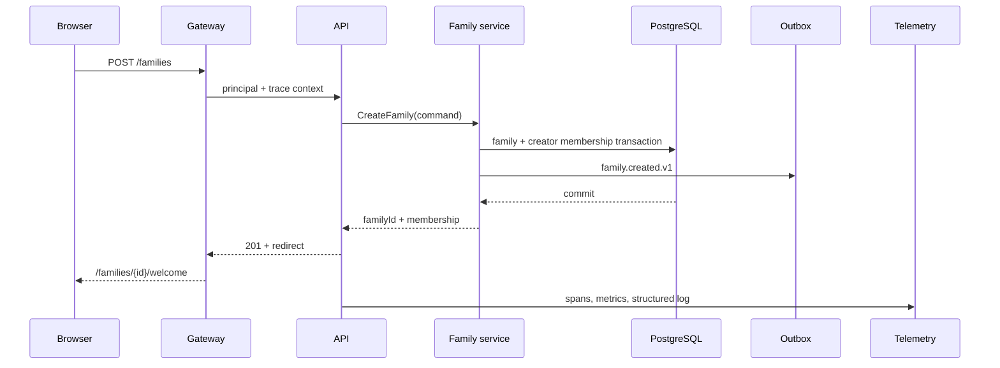
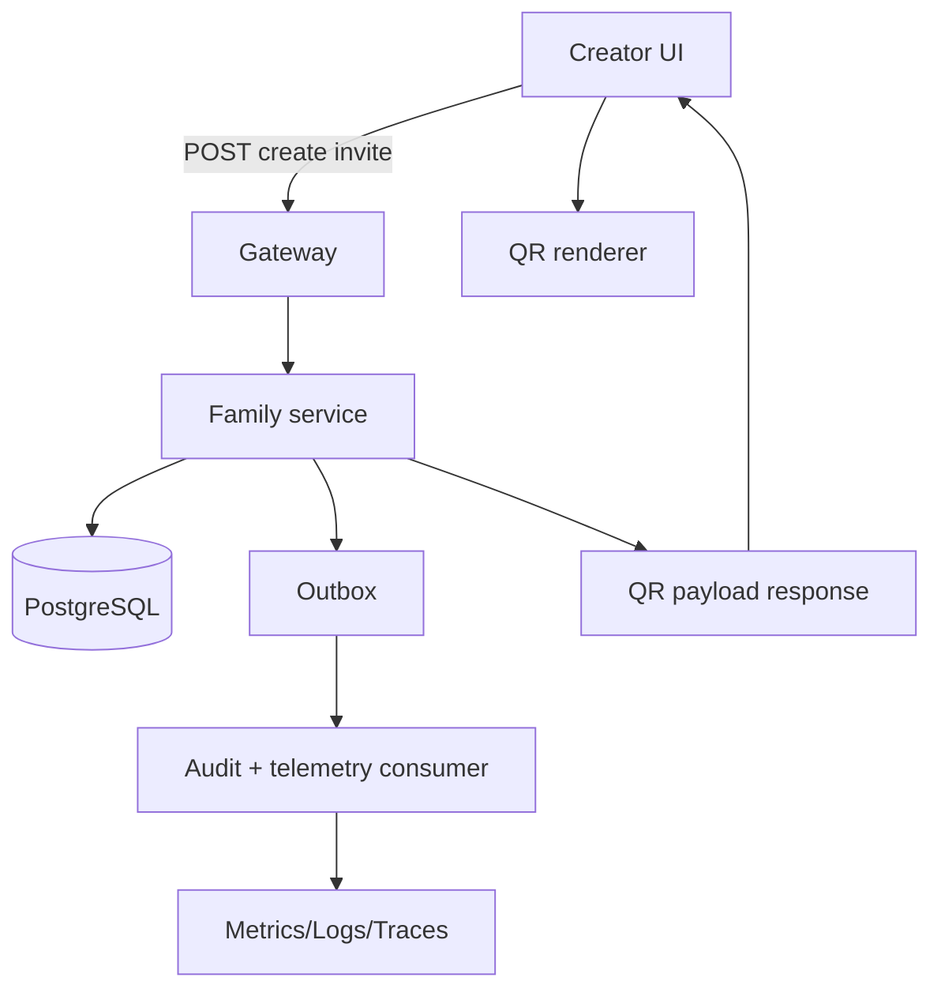
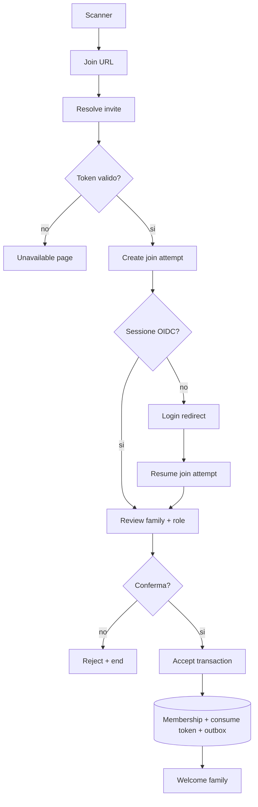
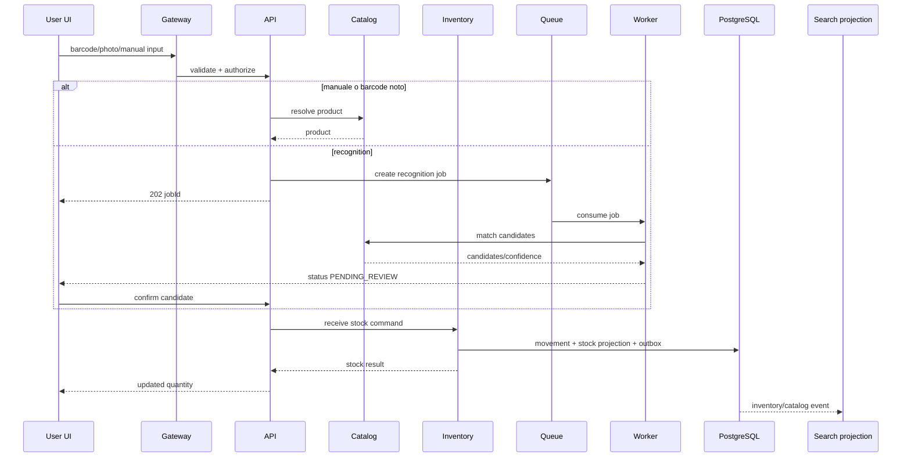
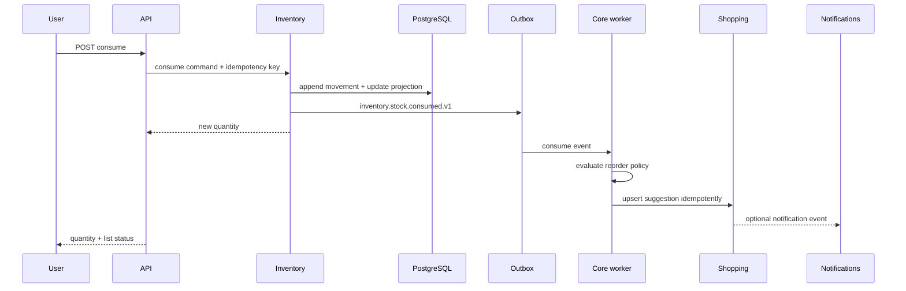
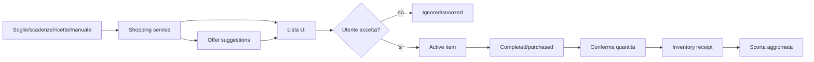
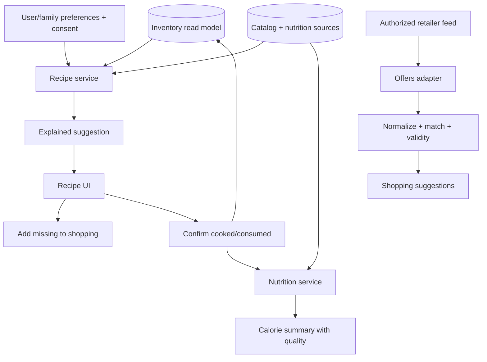

# Flussi dati, UI e contratti operativi

## 1. Scopo

Questo documento descrive il comportamento osservabile dell'interfaccia e il percorso dei dati tra servizi. I nomi dei servizi devono restare stabili anche se vengono eseguiti nello stesso container o separati in Kubernetes.

## 2. Convenzioni UI

### Stati standard

Ogni schermata asincrona espone almeno:

- `idle`: nessuna operazione;
- `loading`: richiesta in corso;
- `success`: dati disponibili;
- `empty`: nessun dato, con call to action;
- `pending`: job accettato ma non terminato;
- `degraded`: dati core disponibili, capability opzionale non disponibile;
- `offline`: ultimo stato sincronizzato e operazioni in coda;
- `error`: errore con azione di recupero;
- `forbidden`: permesso insufficiente senza leak di dati.

### Redirect contract

Il frontend usa redirect nominati e sicuri:

| Stato | Redirect |
|---|---|
| sessione assente | `/login?returnTo=<allowlisted-path>` |
| nessuna famiglia | `/families/create` |
| famiglia appena creata | `/families/{familyId}/welcome` |
| invito valido non autenticato | `/join/review?attempt=<opaque-id>` dopo login |
| invito accettato | `/families/{familyId}/welcome` |
| invito scaduto/non disponibile | `/join/unavailable` |
| permesso insufficiente | `/forbidden` |
| servizio opzionale indisponibile | mantiene pagina + banner `DEGRADED` |
| job completato | pagina origine + pannello risultato |
| job fallito | pagina origine + stato/azione retry |

`returnTo` e sempre validato contro una allowlist interna; non sono consentiti redirect aperti verso domini esterni.

## 3. Shell applicativa



La shell mostra famiglia attiva, stato connessione, notifiche e profilo. Il cambio famiglia invalida query cached e crea nuovo contesto autorizzativo; non deve mostrare dati della famiglia precedente durante il cambio.

## 4. Flusso dati: creazione famiglia



Log minimo: outcome, duration, family scope, actor pseudonymized, membership id, trace id. Non loggare nome famiglia se non necessario.

## 5. Flusso dati: invito QR



Il token raw esiste solo nel percorso TLS della risposta e nel QR visualizzato. Il database conserva `tokenHash`; l'outbox conserva solo metadati e mai il token.

## 6. Flusso dati: scansione e accettazione



Ogni transizione ha uno stato persistito o un errore esplicito. Il frontend non decide l'accesso: mostra solo lo stato restituito dal Family service.

## 7. Flusso dati: aggiunta prodotto e stock



UI: modalita singola/batch, review confidence, duplicate warning, quantity/unit/lot/expiry/location, undo e stato job. Nessuna foto o payload raw nei log.

## 8. Flusso dati: consumo, soglia e lista



Se il worker non e attivo, l'outbox resta persistito e la lista assume `PENDING_AUTOMATION`; il consumo non viene perso.

## 9. Flusso dati: lista della spesa e acquisto



La riga non diventa automaticamente stock solo perche e stata marcata acquistata: serve conferma della quantita, salvo una preferenza esplicita e reversibile.

## 10. Flusso dati: ricette, nutrizione e offerte



I suggerimenti possono essere `VERIFIED`, `IMPORTED` o `AI_PROPOSED`. I filtri allergeni esclusi sono hard constraint; dati mancanti vengono mostrati come unknown, non stimati silenziosamente.

## 11. Contratto di stato UI/job

```json
{
  "jobId": "uuid",
  "capability": "RECOGNITION|RECIPE|OFFERS|EXPORT",
  "status": "PENDING|PROCESSING|PENDING_REVIEW|COMPLETED|FAILED|CANCELLED|DEGRADED",
  "progress": 0,
  "createdAt": "timestamp",
  "updatedAt": "timestamp",
  "retryable": true,
  "resultUrl": "/api/v1/jobs/uuid/result",
  "error": {"code":"PROVIDER_TIMEOUT","message":"Azione disponibile all'utente"},
  "traceId": "hex"
}
```

Il client aggiorna lo stato tramite polling con backoff o subscription autorizzata; non deve tenere una richiesta HTTP aperta per lavori lunghi.

## 12. Logging per operazione

Ogni log operativo deve poter rispondere a:

- chi ha iniziato l'operazione;
- quale famiglia e risorsa erano coinvolte, in forma pseudonimizzata;
- quale route/command/event e stato elaborato;
- quando e durato e quanto tempo per ogni dipendenza;
- quale risultato e stato prodotto;
- se e stato ritentato e perche;
- quale `traceId`, `spanId`, `jobId` e `eventId` collegano i componenti;
- quale errore pubblico e quale categoria interna sono state usate.

Schema log minimo:

```json
{
  "timestamp":"timestamp",
  "level":"INFO",
  "service":"inventory",
  "version":"build",
  "environment":"home-small",
  "traceId":"hex",
  "spanId":"hex",
  "requestId":"uuid",
  "eventId":"uuid|null",
  "jobId":"uuid|null",
  "familyIdHash":"hash",
  "operation":"inventory.consume",
  "status":"SUCCESS|FAILED|RETRY|DEGRADED",
  "durationMs":42,
  "dependencyDurationsMs":{"postgres":12,"redis":3},
  "attempt":1,
  "errorCode":null
}
```

## 13. Metriche per flusso

### UI/gateway

`http_requests_total`, `http_request_duration_seconds`, `http_errors_total`, `redirect_total`, `auth_redirect_total`, `rate_limit_total`, `frontend_action_duration_seconds`.

### Family/join

`family_created_total`, `family_membership_active`, `family_invite_*`, `join_duration_seconds`, `join_conflict_total`.

### Inventory/shopping

`stock_movements_total`, `stock_movement_duration_seconds`, `stock_quantity_conflict_total`, `reorder_suggestion_total`, `shopping_item_accept_total`, `shopping_completion_duration_seconds`.

### Async

`job_created_total`, `job_duration_seconds`, `queue_depth`, `oldest_job_age_seconds`, `consumer_lag`, `retry_total`, `dlq_size`, `handler_duration_seconds`.

### Data quality

`recognition_confidence`, `catalog_match_rate`, `nutrition_unknown_rate`, `offer_stale_rate`, `recipe_acceptance_rate`, `projection_lag_seconds`.

Metriche con cardinalita controllata: route, service, capability, outcome, error category, provider e role. Mai token, user id, family id raw, trace id o barcode come label.

## 14. UI acceptance matrix

| Funzione | Stati da verificare | Azioni | Telemetria |
|---|---|---|---|
| onboarding | empty/loading/error/success | skip, retry, continue | funnel step duration |
| QR invite | active/expired/revoked/used | show, revoke, regenerate, scan | invite outcomes |
| stock add | manual/recognized/review/duplicate | confirm, edit, undo | recognition + movement |
| stock view | fresh/stale/offline/degraded | filter, search, refresh | query latency + stale |
| consume | success/conflict/invalid | partial, waste, undo | movement outcome |
| shopping | suggested/accepted/snoozed/completed | batch actions, share, purchase | acceptance/conversion |
| recipe | verified/AI/missing/error | adapt, cook, add missing | ranking + feedback |
| offers | active/stale/unavailable | compare, dismiss | source quality |
| profile | opt-in/opt-out/unknown | explain, correct, delete | consent events |

## 15. Regole di implementazione per il team

- prima si definisce lo stato UI e il contratto, poi il componente visuale;
- ogni redirect ha un target allowlisted e un test;
- ogni mutazione ha idempotenza e feedback di esito;
- ogni lavoro lungo ha job status e non blocca la UI;
- ogni servizio ha span e metriche prima di essere dichiarato pronto;
- ogni dato mostrato all'utente espone qualita/staleness quando puo essere incerto;
- ogni errore offre una prossima azione comprensibile;
- nessuna telemetria deve introdurre una dipendenza dal dominio o una perdita di privacy.
