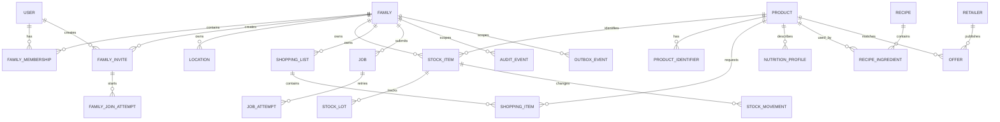

# ERD e ownership dati

## 1. Regole

- `family_id` e obbligatorio su ogni dato condiviso di famiglia;
- identificativi UUID, timestamp UTC e optimistic `version` dove esiste modifica concorrente;
- record ledger/eventi append-only;
- foreign key e unique constraint sono parte del contratto;
- dati di altri bounded context sono referenziati per ID e non aggiornati direttamente;
- soft delete solo dove serve audit; altrimenti status/tombstone esplicito;
- ogni tabella proprietaria ha migration owner e retention.

## 2. ERD logico

## 3. Tabelle principali

### Identity/family schema

`users(id, status, created_at, updated_at)`

`external_identities(id, user_id, issuer, subject, email_hash, created_at)` unique `(issuer, subject)`.

`families(id, display_name, creator_user_id, tenant_id nullable, locale, timezone, unit_system, status, version, created_at, updated_at)`.

`family_memberships(id, family_id, user_id, role, status, invited_by, joined_at, removed_at, version)` unique active `(family_id, user_id)`.

`family_invites(id, family_id, created_by, role, token_hash, fallback_code_hash, status, expires_at, consumed_at, revoked_at, created_at)` unique token hash.

`family_join_attempts(id, invite_id, user_id nullable, browser_binding_hash, state, expires_at, completed_at, trace_id, created_at)`.

### Catalog schema

`products(id, canonical_name, brand_id nullable, category_id nullable, default_unit, status, provenance_quality, version, created_at, updated_at)`.

`product_identifiers(id, product_id, source_id, identifier_type, normalized_value, is_verified, created_at)` unique `(source_id, identifier_type, normalized_value)`.

`product_aliases(id, product_id, locale, alias, source_id, confidence)`.

`data_sources(id, kind, name, license_ref, reliability_class, created_at)`.

`data_provenance(id, entity_type, entity_id, source_id, observed_at, source_version, confidence, raw_ref nullable)`.

### Inventory schema

`locations(id, family_id, name, kind, status)`.

`stock_items(id, family_id, product_id, package_id nullable, location_id nullable, current_quantity, unit, reorder_point nullable, status, version, created_at, updated_at)` unique active semantic key defined by product/package/location policy.

`stock_lots(id, stock_item_id, lot_code nullable, received_at, expires_at nullable, opened_at nullable, quantity_snapshot nullable)`.

`stock_movements(id, family_id, stock_item_id, kind, quantity, unit, source, client_operation_id, actor_id nullable, occurred_at, created_at, metadata jsonb)` unique `(family_id, client_operation_id)`.

`stock_thresholds(id, family_id, product_id, location_id nullable, reorder_point, policy_version, updated_at)`.

### Shopping schema

`shopping_lists(id, family_id, name, status, owner_user_id, version, created_at, updated_at)`.

`shopping_items(id, list_id, product_id nullable, display_name, quantity, unit, package_id nullable, state, source_type, source_ref nullable, completed_at nullable, version)` unique active semantic key per list.

`shopping_item_sources(id, item_id, source_type, source_ref, reason_code, created_at)`.

### Recipe/nutrition/offer schema

`recipes(id, source_id, title, instructions_ref, quality, servings, status, version)`.

`recipe_ingredients(id, recipe_id, product_id nullable, normalized_name, quantity, unit, optional, substitution_group)`.

`nutrition_profiles(id, product_id, source_id, serving_quantity, serving_unit, calories, nutrients jsonb, allergens jsonb, quality, observed_at, expires_at)`.

`retailers(id, name, source_id, status)`; `stores(id, retailer_id, area_code, address_ref, status)`.

`offers(id, retailer_id, store_id nullable, product_id nullable, external_sku, price numeric, currency, unit_price numeric nullable, valid_from, valid_to, conditions jsonb, source_id, quality, imported_at)`.

### Workflow/audit schema

`jobs(id, family_id nullable, capability, status, idempotency_key, current_attempt, next_attempt_at, result_ref nullable, last_error_code nullable, trace_id, created_at, updated_at)` unique scope/idempotency.

`job_attempts(id, job_id, attempt, started_at, finished_at, status, error_code nullable, duration_ms nullable)` unique `(job_id, attempt)`.

`inbox_events(id, consumer_name, event_id, processed_at, outcome)` unique `(consumer_name, event_id)`.

`outbox_events(id, event_id, event_type, event_version, aggregate_type, aggregate_id, family_id nullable, payload jsonb, status, available_at, published_at nullable, created_at)` unique `event_id`.

`audit_events(id, family_id nullable, actor_id nullable, action, resource_type, resource_id, outcome, reason nullable, trace_id, metadata jsonb, created_at)` append-only.

## 4. Ownership matrix

| Schema/aggregato | Owner | Scrittura consentita | Lettura |
|---|---|---|---|
| identity | Identity | Identity service | policy services |
| family | Family | Family service | authorized services |
| catalog | Catalog | Catalog service/operator | read models |
| inventory | Inventory | Inventory service | Shopping/Nutrition projections |
| shopping | Shopping | Shopping service/Core worker | family members |
| recipe | Recipe | Recipe service/operator | authorized family |
| nutrition | Nutrition | Nutrition service/source importer | recipe/analytics |
| offers | Offers | Offers service | shopping/read models |
| jobs/outbox/inbox | Platform/owning service | owner/worker | operations/audit |
| audit | Audit | audit writer only | authorized operators |

## 5. Consistency boundaries

### Strong consistency

Family accept, membership/role, stock movement, shopping mutation, idempotency, outbox insert, audit of security actions.

### Eventual consistency

Search index, recipe ranking, offers freshness, notification delivery, analytics/profile features, dashboard aggregates.

La UI mostra `updatedAt`, `projectionLag` o stato `PENDING/STALE` quando una proiezione non e aggiornata.

## 6. Evoluzione

- schema changes con expand-contract;
- nuove colonne nullable/default prima del nuovo writer;
- backfill idempotente e osservato;
- rimozione solo dopo periodo di compatibilita;
- migrazioni per schema owner, mai migration nascoste all'avvio di ogni servizio;
- partizionamento solo dopo benchmark;
- backup e restore testati prima di migration distruttive.
