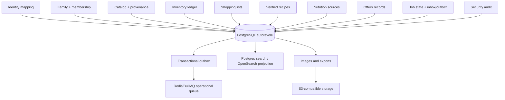

# Architettura dati e strategia database

## 1. Decisione sintetica

La piattaforma adottera una strategia **polyglot persistence controllata**:

1. **PostgreSQL** come database relazionale primario e fonte autorevole per identita applicativa, famiglie, membership, catalogo, inventario, consumi, liste, ricette verificate, nutrizione, offerte, job, outbox e audit.
2. **Redis** per cache, lock brevi e broker operativo delle code; non e fonte autorevole e non conserva l'unica copia di un dato.
3. **S3-compatible object storage** per foto, allegati, immagini prodotto, export e backup; non e un database relazionale.
4. **PostgreSQL full-text/trigram** per la ricerca iniziale e per il profilo domestico.
5. **OpenSearch** come proiezione opzionale quando benchmark, volume o ranking lo richiedono.
6. **Database a grafo** non necessario per account/famiglie nella prima architettura; potra essere una proiezione opzionale per raccomandazioni molto avanzate, solo dopo benchmark e definizione di un caso d'uso.

La regola e: un solo sistema autorevole per ogni aggregato, proiezioni ricostruibili per letture specializzate e nessun nuovo database introdotto soltanto perche e scalabile sulla carta.

## 2. Perche PostgreSQL e la fonte autorevole

Il dominio ha molte invarianti che devono essere applicate atomicamente:

- una membership attiva unica per coppia famiglia/utente;
- un invito QR monouso e non riutilizzabile;
- ledger immutabile dei movimenti;
- quantita e soglie coerenti;
- deduplicazione di comandi e eventi;
- liste e suggerimenti idempotenti;
- outbox scritto nella stessa transazione del cambiamento;
- audit collegato a actor, famiglia e risorsa;
- vincoli tra prodotto, lotto, unita, scadenza e famiglia;
- cancellazione o anonimizzazione propagata alle proiezioni.

PostgreSQL offre transazioni ACID, foreign key, unique/exclusion constraint, locking, `numeric`, indici B-tree/GiST/GIN, full-text search, JSONB per attributi variabili, viste/materialized views, Row Level Security e backup PITR. In questo dominio riduce il rischio di inconsistenze più di quanto un database distribuito separato aumenterebbe la scalabilità iniziale.

## 3. Bounded context e ownership dati



### Tabelle per area

| Area | Tabelle/aggregati | Fonte autorevole | Pattern |
|---|---|---|---|
| Identity | `users`, `external_identities`, `sessions_metadata` | IdP per credenziali; PostgreSQL per mapping | relational |
| Family | `families`, `family_memberships`, `family_invites`, `family_join_attempts` | PostgreSQL | relational + constraints |
| Access | `roles`, `permissions`, `policy_versions` | PostgreSQL/config signed | relational |
| Catalog | `products`, `identifiers`, `brands`, `categories`, `provenance` | PostgreSQL | relational + JSONB extension |
| Inventory | `stock_items`, `lots`, `movements`, `thresholds`, `locations` | PostgreSQL ledger | append-only + projections |
| Shopping | `shopping_lists`, `shopping_items`, `suggestion_sources` | PostgreSQL | relational |
| Recipes | `recipes`, `ingredients`, `substitutions`, `sources` | PostgreSQL/source adapter | relational |
| Nutrition | `nutrition_profiles`, `nutrients`, `allergens`, `quality` | PostgreSQL/source version | relational |
| Offers | `offers`, `retailers`, `stores`, `validity`, `conditions` | PostgreSQL | relational + temporal indexes |
| Jobs/events | `jobs`, `inbox_events`, `outbox_events`, `dead_letters` | PostgreSQL | durable workflow metadata |
| Audit | `audit_events` | PostgreSQL append-only + export | immutable/event-like |
| Search | `search_documents` o indice OpenSearch | projection | rebuildable |
| Media | object metadata in PG, bytes in S3 | S3 + metadata transaction | object storage |
| Analytics/profile | aggregate features with TTL | PostgreSQL initially; warehouse later | opt-in projection |

Un servizio non accede alle tabelle proprietarie di un altro servizio. Su un singolo PostgreSQL questo e un confine logico: schema separati, ruoli DB separati, repository e migrazioni owner-specifiche, foreign key cross-schema solo se approvate. Quando si separa un servizio, il contratto resta uguale.

## 4. Valutazione delle tecnologie

### PostgreSQL

**Fit: primario, raccomandato.**

Punti forti: consistenza, vincoli, query relazionali, audit, transazioni outbox, ricerca iniziale, JSONB, maturita, backup, costo operativo basso e funzionamento eccellente su un singolo PC.

Limiti: scaling write non infinito, schema/migration discipline necessaria, ricerca fuzzy e raccomandazioni molto grandi richiedono proiezioni.

### MySQL/MariaDB

**Fit: possibile ma non preferito.**

Sono validi relazionali, ma PostgreSQL offre un insieme più ricco e coerente per JSONB, full-text/trigram, constraint avanzati, RLS e pattern event/outbox. Cambiare scelta avrebbe senso solo per competenza aziendale, piattaforma gestita o vincolo di hosting.

### SQLite

**Fit: locale/test/offline, non fonte multiutente server.**

Ottimo per test, demo, cache locale PWA o installazioni embedded. Non sostituisce PostgreSQL per worker concorrenti, code durabili, membership condivise e future installazioni retailer.

### MongoDB/document store

**Fit: non primario; possibile adapter/proiezione specifica.**

Utile per documenti variabili, cataloghi con attributi fortemente eterogenei o payload raw di provider. Tuttavia famiglie, inventario, movimenti, ruoli e outbox richiedono vincoli e relazioni; duplicare questi dati in Mongo aumenta inconsistenza e costo operativo. PostgreSQL JSONB copre l'eterogeneita iniziale senza introdurre un secondo sistema.

### DynamoDB/Cosmos DB/key-value distribuiti

**Fit: solo deployment cloud ad altissima scala e workload progettato per access pattern fissi.**

Offrono scaling e disponibilita, ma richiedono denormalizzazione, progettazione per query note, gestione transazioni limitate e costi cloud. Sono inadatti come scelta iniziale per un server domestico e non risolvono da soli ricerca, grafi o audit.

### Redis/Key-value

**Fit: cache, code, lock e rate limit; non primario.**

Redis e veloce e utile per TTL, queue e stato effimero. Non deve essere l'unica copia di scorte, membership, inviti o eventi. AOF/snapshot aiutano ma non sostituiscono PostgreSQL e backup.

### OpenSearch/Elasticsearch

**Fit: proiezione search opzionale.**

Serve per fuzzy search, ranking, faceting, sinonimi, autocomplete e grandi cataloghi. Ha costo di RAM/CPU, consistenza eventuale, mapping e operazioni proprie. Si introduce solo quando PostgreSQL benchmarkato non raggiunge i target.

### Neo4j/ArangoDB/graph database

**Fit: non necessario per account/famiglie; eventuale proiezione raccomandazioni futura.**

Un grafo e utile per attraversamenti multi-hop come ingredienti-sostituzioni-ricette-preferenze-retailer, rilevazione di similarita e recommendation graph. Non e la scelta migliore per:

- membership famiglia/ruolo/invito, dove servono unique constraint e transazioni;
- ledger inventario e quantita;
- audit e retention;
- CRUD e query di dashboard;
- un server domestico con RAM limitata.

La relazione famiglia -> membership -> utente e un grafo concettuale ma una struttura relazionale semplice. Un graph DB diventerebbe giustificato solo con un caso d'uso misurato, ad esempio ranking multi-hop non efficiente in PostgreSQL/OpenSearch. In quel caso si alimenta da eventi e resta una read model ricostruibile, mai la fonte delle membership o delle scorte.

### Time-series database

**Fit: non necessario per il dominio; Prometheus per telemetry.**

Consumi, prezzi e metriche possono avere serie temporali, ma inizialmente PostgreSQL con indici temporali e Prometheus per osservabilita bastano. Un database time-series dedicato si valuta per analytics storici ad alto volume, non per il ledger.

### Data warehouse/lakehouse

**Fit: fase enterprise/analytics.**

Serve per BI, forecasting, metriche aggregate multi-tenant e training controllato. Non deve essere usato nel path transazionale. Va alimentato con dati minimizzati, consenso e policy tenant.

## 5. Decisione per ambiente

### Profilo `home-small`

```text
PostgreSQL 1 instance + backup esterno
Redis 1 instance
S3-compatible locale o storage remoto
PostgreSQL FTS/trigram
Prometheus/Grafana e profilo osservabilita leggero
```

Nessun MongoDB, Neo4j, OpenSearch, warehouse o cluster database. Questo mantiene RAM e manutenzione compatibili con un vecchio PC.

Nel primo rilascio `family-local`, PostgreSQL, Redis, MinIO e lo stack Grafana/Prometheus/Alertmanager/OTel/Loki/Tempo sono tutti container locali. Il fatto che siano locali non cambia ownership o contratti: PostgreSQL resta autorevole, Redis ricostruibile e la telemetria non blocca il dominio.

### Profilo `home-plus`

```text
PostgreSQL con WAL/archive e restore drill
Redis con AOF e ricostruzione da outbox
S3 versioning
PostgreSQL search + eventuale OpenSearch se benchmarkato
Loki/Tempo opzionali
```

### Profilo `production`

```text
PostgreSQL gestito o HA con replica/failover e PITR
Redis HA/managed per code e cache
Object storage ridondato con versioning
OpenSearch gestito o cluster dedicato se i KPI search lo richiedono
Warehouse separato per analytics aggregati
Graph projection solo con caso d'uso e budget dimostrati
```

Kubernetes orchestra i componenti stateless e i worker. Non rende automaticamente sicuri i database stateful: storage, backup, replica, failover e restore devono essere progettati separatamente.

## 6. Invarianti e transazioni

### Famiglia e membership

- unique `(family_id, user_id)` per membership attiva;
- token invite solo hash, unique hash, `expires_at`, `consumed_at`, `revoked_at`;
- accept invito: verifica token, crea membership, consuma invito, scrive outbox/audit in una transazione;
- cambio famiglia attiva e contesto di sessione, non modifica ownership dati.

### Inventario

- `stock_movements` append-only;
- saldo ottenuto da movimento/proiezione con reconciliation;
- command idempotency unique per `(family_id, client_operation_id)`;
- lock/serializzazione per aggregato stock;
- unita compatibili verificate prima della transazione;
- rettifica come nuovo movimento, mai update distruttivo.

### Outbox/inbox

- record dominio e outbox nella stessa transazione;
- publisher idempotente;
- consumer inbox unique su `event_id`/handler;
- replay con nuova execution id;
- proiezioni search/graph ricostruibili dagli eventi o snapshot validati.

## 7. Strategia di scaling

Ordine consigliato:

1. indici, query plan, connection pool e retention corretti;
2. separazione read/write logica e proiezioni;
3. caching Redis per dati non autorevoli;
4. worker e code scalati indipendentemente;
5. read replica PostgreSQL per query pesanti;
6. partizionamento per eventi temporali, tenant o famiglia solo con benchmark;
7. OpenSearch per search specialistica;
8. warehouse per analytics;
9. sharding/tenant database separati solo con carico e requisiti di isolamento reali.

Non introdurre sharding o database per servizio prima di conoscere workload, cardinalita, pattern di query e costi di consistenza.

## 8. Partizionamento e indici candidati

Da validare con benchmark, non applicare automaticamente:

- `stock_movements` per mese o famiglia quando volume e retention lo giustificano;
- `audit_events` per mese e policy retention;
- `outbox_events` per stato/created_at con cleanup sicuro;
- indici `(family_id, status)`, `(family_id, product_id)`, `(family_id, expires_at)`;
- unique su barcode normalizzato e identificatori con gestione fonte/ambito;
- GIN/trigram su nome, alias e brand;
- offerte su `(retailer_id, area, valid_from, valid_to)`;
- inviti su `token_hash`, `status`, `expires_at`;
- job su `(status, next_attempt_at)` e queue.

## 9. Backup, migrazioni e disaster recovery

- backup logico per export e backup fisico/PITR per recovery;
- WAL e backup fuori dal nodo principale quando possibile;
- test restore con checksum e conteggio aggregati;
- migrazioni expand-contract, compatibili con vecchia e nuova versione;
- snapshot prima di modifiche distruttive;
- proiezioni search/graph eliminate e ricostruite dopo restore;
- secret e chiavi backup separati dal database;
- RPO/RTO dichiarati per profilo e provati con drill.

## 10. Criteri per introdurre un nuovo database

Un nuovo motore e approvabile solo se:

1. esiste un workload reale non sostenibile dal database attuale;
2. le query e KPI sono misurati con benchmark riproducibile;
3. e definito il proprietario dei dati e il sistema autorevole;
4. esistono pipeline outbox/replay e gestione staleness;
5. backup, restore, migrazione, monitoraggio e sicurezza sono documentati;
6. il costo CPU/RAM/disco e operativo e compatibile con il profilo target;
7. il fallimento del nuovo database non blocca il core se e una proiezione;
8. il team accetta una ADR con conseguenze e piano di rimozione.

## 11. Decisione finale

Per il progetto attuale la scelta più solida e:

> **PostgreSQL come unico database autorevole + Redis per workload effimero/asincrono + object storage per media + ricerca PostgreSQL iniziale; OpenSearch, warehouse o graph database solo come proiezioni opzionali motivate da benchmark.**

Questa scelta non limita la futura scalabilita Kubernetes: separa i contratti e i worker oggi, preserva consistenza e semplicita sul server domestico e permette di estrarre read models o database specializzati senza migrare la fonte autorevole del dominio.
