# Diagrammi tecnici

I diagrammi descrivono la struttura verificata in `main` al commit `c79a92a343fb30a29cf3e4ec8eca7d984453a30c`. La fonte operativa resta il codice: `docker-compose.yml`, route/server, worker e migration SQL dei servizi.

## Indice

- [Architettura di runtime](#architettura-di-runtime)
- [Database e storage](#database-e-storage)
- [Flussi funzionali](#flussi-funzionali)
  - [Richiesta, sessione e autorizzazione](#richiesta-sessione-e-autorizzazione)
  - [Ricerca e risoluzione barcode](#ricerca-e-risoluzione-barcode)
  - [Identità semantica degli alimenti](#identità-semantica-degli-alimenti)
  - [Dispensa, movimenti ed eventi](#dispensa-movimenti-ed-eventi)
  - [Ricette, disponibilità e completamento](#ricette-disponibilità-e-completamento)
  - [Lista della spesa e riordino](#lista-della-spesa-e-riordino)
  - [Scontrini e OCR](#scontrini-e-ocr)
  - [Scadenze](#scadenze)
  - [Famiglie e inviti](#famiglie-e-inviti)
  - [Notifiche](#notifiche)
  - [Privacy](#privacy)
  - [Osservabilità](#osservabilità)
- [Mappa delle funzioni HTTP](#mappa-delle-funzioni-http)

## Architettura di runtime

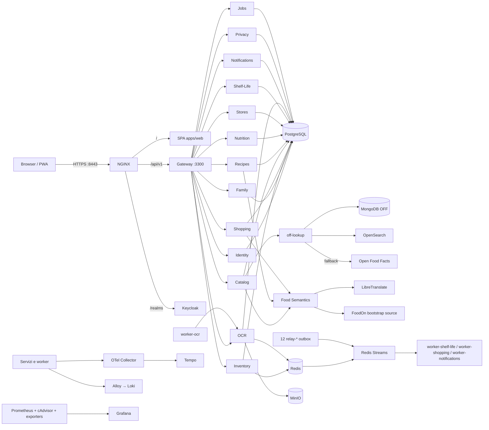

Tutte le API applicative passano dal gateway dietro NGINX. Le porte interne non sono pubblicate dal compose. I servizi scrivono sul proprio database logico; PostgreSQL è un cluster condiviso, non un database condiviso. Keycloak possiede `keycloak_db`.

## Database e storage

Il bootstrap Compose crea 13 database applicativi dal file `infrastructure/postgres/init/00-databases.sql`; `postgres-app-role-init` aggiunge `food_semantics_db` e `keycloak_db`. Sono quindi **15 database logici** nel cluster locale: 14 di dominio e quello di Keycloak.

Gli schemi seguenti riportano le tabelle create dalle migration dei servizi. Le frecce continue rappresentano solo foreign key SQL effettivamente dichiarate; gli UUID che collegano contesti diversi non sono vincoli relazionali tra database.

```mermaid
flowchart TB
  subgraph identity_db["identity_db · service-identity"]
    id_users[users]
    id_diet[dietary_preferences]
    id_outbox[outbox_events]
    id_idem[idempotency_keys]
    id_diet -->|FK user_id| id_users
  end
  subgraph family_db["family_db · service-family"]
    fam_families[families]
    fam_members[members]
    fam_invites[invites]
    fam_join[join_attempts]
    fam_outbox[outbox_events]
    fam_idem[idempotency_keys]
    fam_members -->|FK family_id| fam_families
    fam_invites -->|FK family_id| fam_families
    fam_join -->|FK invite_id| fam_invites
  end
  subgraph inventory_db["inventory_db · service-inventory"]
    inv_lots[pantry_lots]
    inv_items[pantry_items]
    inv_moves[movements]
    inv_reorder[reorder_policies]
    inv_consumers[event_consumers]
    inv_outbox[outbox_events]
    inv_idem[idempotency_keys]
    inv_items -->|FK lot_id| inv_lots
  end
  subgraph shopping_db["shopping_db · service-shopping"]
    shop_lists[shopping_domain.lists]
    shop_items[shopping_domain.items]
    shop_reorder[shopping_domain.reorder_suggestions]
    shop_processed[shopping_domain.processed_events]
    shop_outbox[shopping_domain.outbox_events]
    shop_idem[shopping_domain.idempotency_keys]
    shop_items -->|FK list_id| shop_lists
  end
  subgraph catalog_db["catalog_db · service-catalog"]
    cat_brands[brands]
    cat_sources[data_sources]
    cat_products[products]
    cat_identifiers[product_identifiers]
    cat_provenance[data_provenance]
    cat_semantics[product_food_semantics]
    cat_outbox[outbox_events]
    cat_idem[idempotency_keys]
    cat_migrations[schema_migrations]
    cat_products -->|FK brand_id| cat_brands
    cat_identifiers -->|FK product_id| cat_products
    cat_identifiers -->|FK source_id| cat_sources
    cat_provenance -->|FK source_id| cat_sources
    cat_semantics -->|FK product_id| cat_products
  end
  subgraph notifications_db["notifications_db · service-notifications"]
    notifs[notifications_domain.notifications]
    notif_prefs[notifications_domain.preferences]
    notif_processed[notifications_domain.processed_events]
    notif_outbox[notifications_domain.outbox_events]
    notif_idem[notifications_domain.idempotency_keys]
  end
  subgraph privacy_db["privacy_db · service-privacy"]
    priv_consents[privacy_consents]
    priv_erase[privacy_erasure_requests]
    priv_exports[privacy_export_jobs]
    priv_artifacts[export_artifacts]
    priv_audit[audit_events]
    priv_outbox[outbox_events]
    priv_idem[idempotency_keys]
  end
  subgraph jobs_db["jobs_db · service-jobs"]
    jobs[jobs]
    attempts[job_attempts]
    dead[dead_letter_jobs]
    job_audit[audit_events]
    inbox[inbox_events]
    attempts -->|FK job_id| jobs
    dead -->|FK job_id| jobs
  end
  subgraph recipes_db["recipes_db · service-recipes"]
    user_recipes[recipes_domain.recipes]
    user_ingredients[recipes_domain.recipe_ingredients]
    user_steps[recipes_domain.recipe_steps]
    rec_outbox[recipes_domain.outbox_events]
    rec_idem[recipes_domain.idempotency_keys]
    datasets[recipe_catalog.datasets]
    global_recipes[recipe_catalog.recipes]
    global_ingredients[recipe_catalog.recipe_ingredients]
    global_steps[recipe_catalog.recipe_steps]
    user_ingredients -->|FK recipe_id| user_recipes
    user_steps -->|FK recipe_id| user_recipes
    global_ingredients -->|FK recipe_id| global_recipes
    global_steps -->|FK recipe_id| global_recipes
  end
  subgraph nutrition_db["nutrition_db · service-nutrition"]
    targets[nutrition_domain.targets]
    diary[nutrition_domain.diary_entries]
    nutr_consumers[nutrition_domain.event_consumers]
    nutr_outbox[nutrition_domain.outbox_events]
    nutr_idem[nutrition_domain.idempotency_keys]
  end
  subgraph stores_db["stores_db · service-stores"]
    stores[stores_domain.stores]
    prices[stores_domain.prices]
    offers[stores_domain.offers]
    stores_outbox[stores_domain.outbox_events]
    stores_idem[stores_domain.idempotency_keys]
    prices -->|FK store_id| stores
    offers -->|FK store_id| stores
  end
  subgraph shelf_life_db["shelf_life_db · service-shelf-life"]
    rules[shelf_life_domain.rules]
    profiles[shelf_life_domain.product_profiles]
    predictions[shelf_life_domain.predictions]
    shelf_outbox[shelf_life_domain.outbox_events]
    shelf_idem[shelf_life_domain.idempotency_keys]
  end
  subgraph ocr_db["ocr_db · service-ocr"]
    ocr_jobs[ocr_domain.ocr_jobs]
    drafts[ocr_domain.ocr_drafts]
    draft_items[ocr_domain.ocr_draft_items]
    ocr_outbox[ocr_domain.outbox_events]
    ocr_idem[ocr_domain.idempotency_keys]
    drafts -->|FK job_id| ocr_jobs
    draft_items -->|FK draft_id| drafts
  end
  subgraph food_semantics_db["food_semantics_db · service-food-semantics"]
    sources[food_semantics.ontology_sources]
    entities[food_semantics.entities]
    labels[food_semantics.labels]
    relations[food_semantics.relations]
    mappings[food_semantics.product_mappings]
    cache[food_semantics.resolution_cache]
    labels -->|FK entity_id| entities
    relations -->|FK entity_id| entities
    mappings -->|FK entity_id| entities
    cache -->|FK entity_id| entities
  end
  subgraph external["Database gestiti da runtime esterni"]
    keycloakDb[(keycloak_db · Keycloak)]
    mongo[(MongoDB off_lookup_db.products)]
    redis[(Redis · stream events:domain e code job)]
    minio[(MinIO · oggetti e ricevute)]
    opensearch[(OpenSearch · indice prodotti OFF)]
  end
```

Le migration sono conservate in `services/<servizio>/migrations`. I servizi espongono un eseguibile `migrate.js`; Compose usa job `*-schema-migrate` per Food Semantics e Recipes, mentre gli altri servizi avviano le proprie migration nel rispettivo processo secondo il relativo `server.ts`/entrypoint. I diagrammi ER non includono le colonne: per i campi, i vincoli e gli indici fa fede il relativo SQL.

## Flussi funzionali

### Richiesta, sessione e autorizzazione

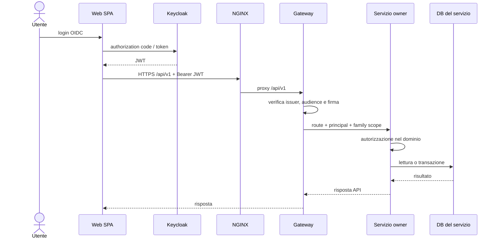

### Ricerca e risoluzione barcode

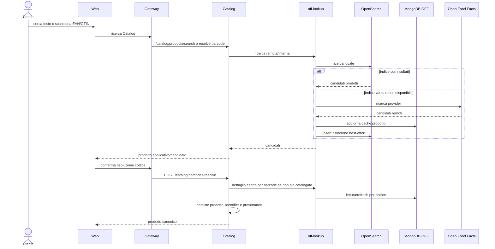

OpenSearch è un indice di ricerca ricostruibile; MongoDB mantiene il corpus/cache OFF. PostgreSQL Catalog conserva i prodotti applicativi e la loro provenienza. Una ricerca testuale che trova un risultato non equivale ancora all'aggiunta in dispensa: la UI deve risolvere/confermare il prodotto e poi chiamare Inventory.

### Identità semantica degli alimenti

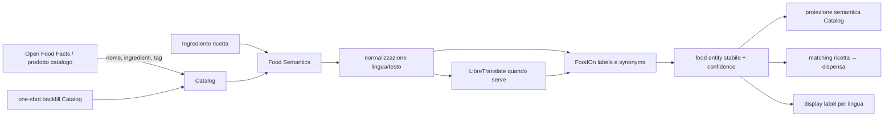

Il resolver restituisce identità/provenienza/confidenza; la traduzione del testo non basta da sola a dimostrare che due prodotti sono equivalenti. La mappatura può rimanere irrisolta quando non ha evidenza sufficiente. Bootstrap FoodOn, backfill Catalog e import ricette sono job distinti.

### Dispensa, movimenti ed eventi

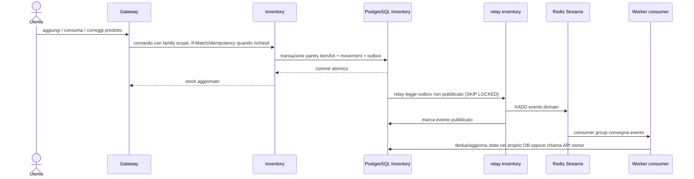

La dispensa e il ledger movimenti sono dati transazionali. Redis Streams trasporta gli eventi; i relay dedicati leggono l'outbox PostgreSQL. Jobs applicativi e stream di eventi sono due usi distinti di Redis.

### Ricette, disponibilità e completamento

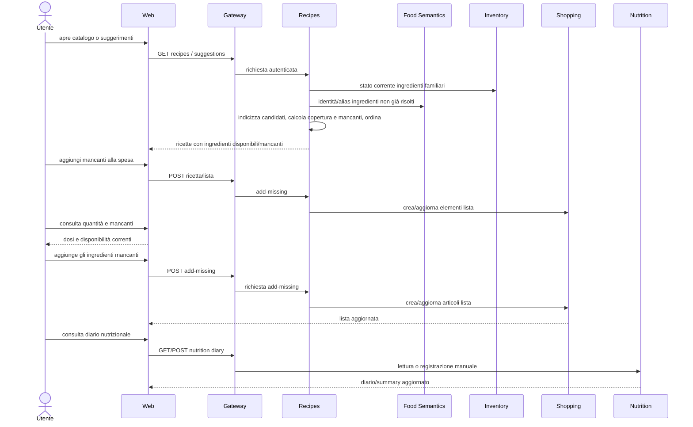

Ingredienti senza quantità misurabile (per esempio “q.b.”) non generano un consumo quantitativo inventato; il dettaglio effettivo dipende dal contratto della ricetta e dal prodotto risolto. Nel codice attuale sono presenti suggerimenti, disponibilità e aggiunta dei mancanti alla spesa. Non risulta una route di completamento ricetta che consumi automaticamente la dispensa e registri i nutrienti; il diario Nutrition espone invece endpoint propri per lettura e inserimento.

### Lista della spesa e riordino

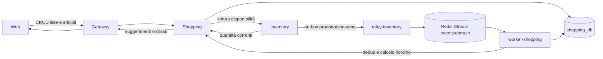

Shopping possiede liste e articoli; la giacenza appartiene a Inventory. I suggerimenti di riordino sono una proiezione/event consumer, non spostano la proprietà dei dati.

### Scontrini e OCR

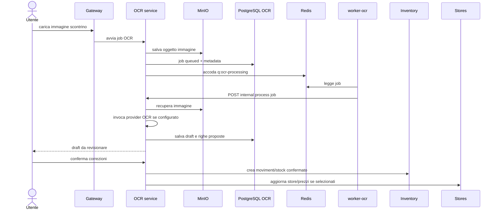

L'OCR produce una bozza; la conferma utente è il passaggio che avvia le mutazioni di dominio. La disponibilità del provider OCR esterno è configurabile.

### Scadenze

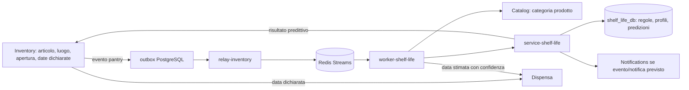

Una data predetta resta distinta da una data dichiarata dall'utente. La predizione non deve essere presentata come certezza né sovrascrivere silenziosamente il dato dichiarato.

### Famiglie e inviti

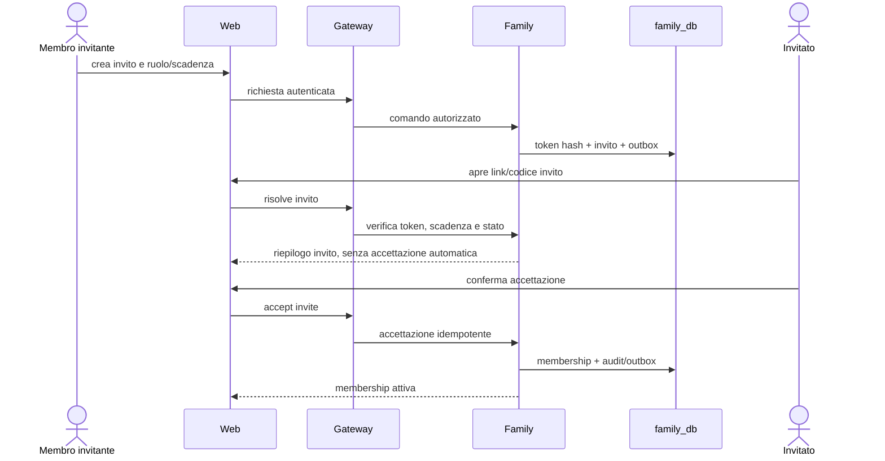

La sola apertura o scansione del link non accetta l'invito.

### Notifiche

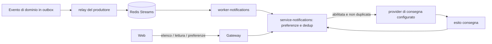

Le preferenze e lo stato delle notifiche sono persistiti dal servizio Notifications. Il provider concreto dipende dalla configurazione disponibile nel deployment.

### Privacy

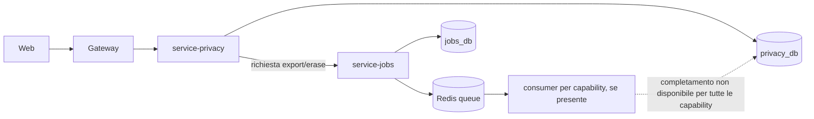

Consensi, richieste e audit sono dati persistiti. Nel codice attuale export/erasure possono essere accodati e osservati come job; non documentiamo un completamento end-to-end se manca il relativo consumer.

### Osservabilità

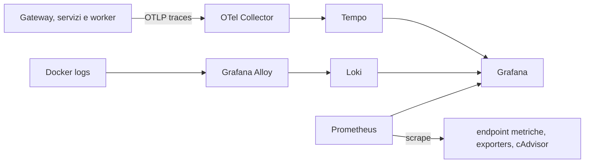

## Mappa delle funzioni HTTP

Le route applicative sono esposte sotto `/api/v1` attraverso il Gateway. I dettagli payload, codici e versioni restano nei route handler e in [openapi.yaml](openapi.yaml); qui è riportata la copertura per area.

| Funzione | Owner | API/entry point presente |
|---|---|---|
| Profilo, autenticazione e preferenze alimentari | Identity | `/me`, identità e preferenze dietetiche |
| Famiglie, membri, inviti e join attempts | Family | route family/invites |
| Articoli, lotti, movimenti, consumo, scadenze e policy riordino | Inventory | route inventory |
| Prodotti, ricerca, dettaglio, batch e risoluzione barcode | Catalog | `/catalog/products*`, `/catalog/barcodes*` |
| Identità alimentare, mapping prodotto e labels | Food Semantics | `/resolve/ingredient`, `/resolve/product`, `/entities/:id` |
| Liste, articoli, batch update, chiusura e suggerimenti | Shopping | `/shopping/lists*`, `/shopping/suggestions` |
| Ricette, ricerca, dettaglio, create/update/delete, suggerimenti e mancanti | Recipes | `/recipes*`, `add-missing` |
| Target, diario e riepilogo nutrienti | Nutrition | `/nutrition/targets`, `/nutrition/diary`, `/nutrition/summary` |
| Negozi, prezzi e offerte | Stores | `/stores*` |
| Regole, predizioni e aggiornamenti scadenza | Shelf-Life | endpoint servizio + worker |
| Upload, job, draft e righe OCR | OCR | servizio OCR + worker |
| Preferenze, elenco e lettura notifiche | Notifications | `/notifications*` |
| Consensi, export e cancellazione | Privacy | `/privacy/consents`, `/privacy/export`, `/privacy/erase` |
| Ispezione e replay amministrativo job | Jobs | route admin/internal protette |
| Lookup prodotti OFF | off-lookup | `/api/v1/search`, `/api/v1/products/:barcode` |
| Ricerca prodotti OFF e sincronizzazione indice | search-indexer | endpoint interni, token obbligatorio |

Questa è una mappa delle capacità applicative, non una lista di tutte le funzioni TypeScript interne. Le route cambiano insieme al contratto del relativo servizio; aggiornare questa tabella e i diagrammi nella stessa modifica delle API.
