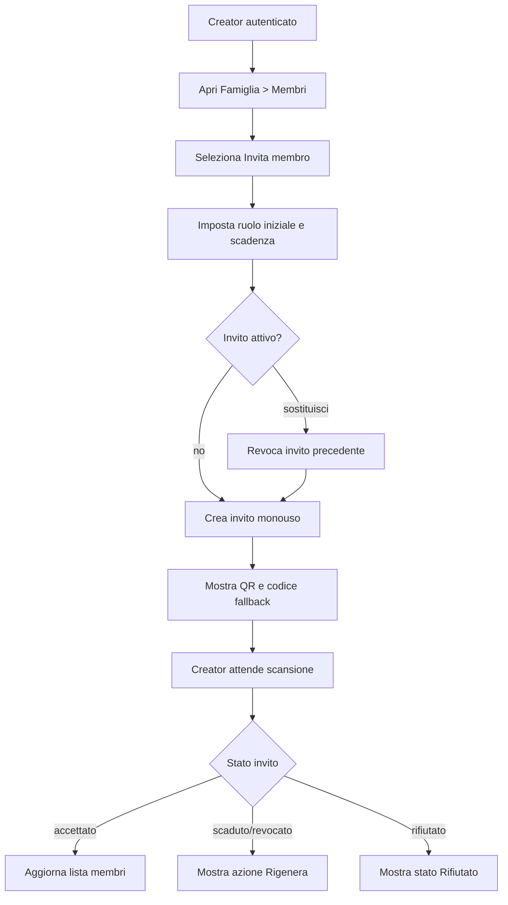
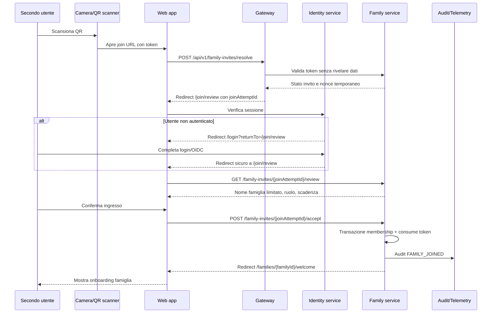

# Profili famigliari e inviti tramite QR code

## 1. Modello concettuale

Il contenitore principale dei dati condivisi e il **family profile**. Nel dominio tecnico viene rappresentato come `household`, ma nell'interfaccia e chiamato **Famiglia**.

```text
Account utente
  |
  +-- Membership -- ruolo --> Profilo famigliare
                              |
                              +-- scorte
                              +-- liste
                              +-- ricette e preferenze condivise
                              +-- impostazioni e consensi condivisi
```

Un utente puo appartenere a piu famiglie, ma ogni operazione deve indicare esplicitamente il `familyId` attivo. Un dato personale, come preferenze individuali o consenso personale, resta dell'utente; scorte e liste appartengono alla famiglia.

## 2. Ruoli

| Ruolo | Permessi principali |
|---|---|
| `CREATOR` | crea famiglia, gestisce membri, ruoli, inviti, impostazioni e cancellazione |
| `ADMIN` | gestisce membri, inviti, ruoli operativi e impostazioni non distruttive |
| `MEMBER` | gestisce scorte, consumi, liste e preferenze proprie |
| `VIEWER` | sola lettura delle risorse condivise |
| `PENDING` | invito accettato ma onboarding non completato |

`CREATOR` e `ADMIN` non possono leggere dati personali non necessari degli altri membri. Il cambio ruolo, espulsione e cancellazione famiglia richiedono conferma forte e audit.

## 3. Creazione della famiglia

### Input

- account autenticato;
- nome famiglia;
- timezone, paese, lingua e unita;
- preferenze iniziali opzionali;
- accettazione informativa e consensi necessari al servizio.

### Output

- `familyId`;
- membership dell'utente con ruolo `CREATOR`;
- sessione con famiglia attiva;
- evento `family.created.v1`;
- audit `FAMILY_CREATED`.

### Stato iniziale

```text
NO_FAMILY -> CREATING -> ACTIVE
                         |
                         +-> SETUP_INCOMPLETE
```

La famiglia puo essere usata anche senza invitare altri membri. L'onboarding suggerisce l'invito, ma non lo rende obbligatorio.

## 4. Invito QR

### Principi di sicurezza

- Il QR contiene un **opaque invitation token**, mai `familyId` sufficiente ad accedere, dati personali o token di sessione.
- Il token e casuale, non reversibile, con entropia crittograficamente sicura.
- Scadenza predefinita breve e configurabile, ad esempio 10 minuti.
- Un token e utilizzabile una sola volta e viene invalidato dopo accettazione, rifiuto, revoca o scadenza.
- Il creator puo revocare l'invito prima dell'uso.
- Il creator puo rigenerare un QR senza lasciare attivi inviti precedenti se sceglie `replaceActiveInvite`.
- Il QR e mostrato solo all'utente autenticato che ha il permesso di invitare.
- Il token non viene scritto nei log, nelle metriche, nei referrer o negli URL permanenti.
- Dopo la scansione il token viene scambiato subito con una sessione temporanea server-side e rimosso dalla barra URL tramite redirect.
- Accettazione e membership sono due passaggi distinti: la scansione non concede accesso automaticamente.

### Formato del QR

```text
https://app.example/join?familyInvite=<opaque-token>
```

Il valore deve essere URL-safe e non deve contenere identificativi leggibili. Il QR deve avere anche un codice breve di fallback visualizzabile solo per digitazione manuale, con gli stessi limiti di scadenza e tentativi.

### Stati invito

```text
CREATED -> DISPLAYED -> SCANNED -> PENDING_ACCEPTANCE -> ACCEPTED
    |          |          |                |
    +----------+----------+----------------+-> EXPIRED
    +-----------------------------------------> REVOKED
    +-----------------------------------------> REJECTED
    +-----------------------------------------> CONSUMED
```

`SCANNED` non significa `ACCEPTED`. Lo stato non deve rivelare a un token non autorizzato il nome della famiglia o il numero dei membri.

## 5. Flusso creator



### Interfaccia creator

La pagina deve mostrare:

- nome famiglia e membro corrente;
- ruolo da assegnare;
- durata invito;
- QR con contrasto e dimensione sufficienti;
- codice fallback con copia esplicita;
- timer di scadenza;
- stato aggiornato senza refresh distruttivo;
- revoca e rigenerazione;
- elenco inviti attivi/scaduti/revocati senza mostrare token;
- istruzione breve: “Fai scansionare questo codice alla persona che vuoi aggiungere”.

Azioni distruttive richiedono conferma. La pagina non deve mostrare il QR in notifiche, log o screenshot automatici.

## 6. Flusso secondo utente



### Regole secondo utente

- Se non autenticato, deve poter completare login/registrazione e tornare al flusso senza perdere l'invito, ma il `joinAttemptId` e temporaneo e legato al browser/sessione.
- Prima della conferma vede solo nome famiglia eventualmente abbreviato, ruolo proposto, creator display name opzionale e scadenza; mai lista scorte, membri o dati privati.
- Deve poter accettare o rifiutare esplicitamente.
- Se appartiene gia alla famiglia, il flusso diventa “Sei gia membro” senza creare duplicati.
- Se ha raggiunto il limite famiglie o il ruolo non e consentito, riceve spiegazione e contatto creator.
- Dopo l'accettazione entra nella famiglia, non in una pagina generica: `/families/{familyId}/welcome`.
- Se il token e scaduto, il redirect va a `/join/expired` con azione per chiedere al creator un nuovo invito.
- Se il token e revocato o gia usato, il redirect va a `/join/unavailable` senza rivelare quale condizione si e verificata a un attaccante.

## 7. Contratto family invite

### Create invite

`POST /api/v1/families/{familyId}/invites`

```json
{
  "role": "MEMBER",
  "expiresInSeconds": 600,
  "replaceActiveInvite": false
}
```

Risposta `201 Created`:

```json
{
  "data": {
    "inviteId": "uuid",
    "familyId": "uuid",
    "role": "MEMBER",
    "status": "CREATED",
    "expiresAt": "timestamp",
    "qrPayload": "https://app.example/join?familyInvite=opaque-token",
    "fallbackCode": "ABCD-EFGH"
  },
  "meta": {"requestId": "uuid", "traceId": "hex"}
}
```

Il `qrPayload` e il `fallbackCode` vengono restituiti solo alla risposta di creazione al creator autorizzato. Non vengono restituiti nelle liste successive degli inviti.

### Resolve invite

`POST /api/v1/family-invites/resolve`

Request:

```json
{"token":"opaque-token","clientNonce":"uuid"}
```

Risposta sempre generica per token non valido:

```json
{
  "data": {
    "joinAttemptId": "uuid",
    "status": "PENDING_AUTHENTICATION",
    "expiresAt": "timestamp"
  },
  "meta": {"requestId": "uuid", "traceId": "hex"}
}
```

Il servizio non restituisce `familyId` o nome famiglia prima di aver creato un tentativo valido e verificato la sessione necessaria.

### Review invite

`GET /api/v1/family-invites/{joinAttemptId}/review`

```json
{
  "data": {
    "familyPreview": {"displayName":"Famiglia Rossi"},
    "proposedRole":"MEMBER",
    "expiresAt":"timestamp",
    "requiresConsent": true
  }
}
```

### Accept invite

`POST /api/v1/family-invites/{joinAttemptId}/accept`

```json
{"accepted":true,"consentVersion":"family-sharing-v1"}
```

Risposta:

```json
{
  "data": {
    "familyId":"uuid",
    "membershipId":"uuid",
    "role":"MEMBER",
    "status":"ACTIVE",
    "redirect":"/families/uuid/welcome"
  }
}
```

L'operazione deve essere atomica: membership, consumo token, evento outbox e audit vengono persistiti nella stessa transazione logica. Retry della stessa richiesta restituisce lo stesso esito; non crea una seconda membership.

## 8. Modello dati minimo

### `families`

`id`, `display_name`, `owner_user_id`, `timezone`, `locale`, `default_unit_system`, `status`, `created_at`, `updated_at`.

### `family_memberships`

`id`, `family_id`, `user_id`, `role`, `status`, `joined_at`, `invited_by`, `removed_at`, `version`.

Vincolo unico: `(family_id, user_id)` per membership attive.

### `family_invites`

`id`, `family_id`, `created_by`, `role`, `token_hash`, `fallback_code_hash`, `status`, `expires_at`, `consumed_at`, `revoked_at`, `created_at`, `last_state_change_at`.

Mai memorizzare il token raw. Il fallback code deve avere rate limit e hash separato.

### `family_join_attempts`

`id`, `invite_id`, `browser_binding_hash`, `user_id`, `state`, `created_at`, `expires_at`, `completed_at`, `trace_id`.

Il join attempt e breve, monouso e non sostituisce la sessione OIDC.

## 9. Eventi

- `family.created.v1`
- `family.invite.created.v1`
- `family.invite.scanned.v1`
- `family.invite.accepted.v1`
- `family.invite.rejected.v1`
- `family.invite.revoked.v1`
- `family.member.role-changed.v1`
- `family.member.removed.v1`

Payload comune: `eventId`, `eventType`, `eventVersion`, `occurredAt`, `familyId`, `membershipId/inviteId`, `actorType`, `actorId` pseudonimizzato, `traceId`, `schemaRef`. Mai token, fallback code o dati non necessari.

## 10. Logging, audit e metriche

### Log applicativi

Campi comuni: `timestamp`, `traceId`, `requestId`, `service`, `route`, `method`, `status`, `durationMs`, `actorType`, `familyId` pseudonimizzato, `inviteId`, `joinAttemptId`, `outcome`, `errorCode`, `retryable`.

Non registrare: token QR, codice fallback, URL completo con query, nome famiglia nei log tecnici, contenuto camera, cookie, token OIDC o IP completo oltre la retention strettamente necessaria.

### Audit eventi

Audit append-only per:

- `FAMILY_CREATED`;
- `INVITE_CREATED`, `INVITE_SCANNED`, `INVITE_ACCEPTED`, `INVITE_REJECTED`, `INVITE_REVOKED`;
- `MEMBER_JOINED`, `MEMBER_REMOVED`, `ROLE_CHANGED`;
- fallimenti ripetuti del fallback code;
- accessi negati e tentativi di abuso.

L'audit registra actor, famiglia, invito, esito, timestamp, motivo e trace id, non il segreto usato.

### Metriche

- `family_created_total`;
- `family_members_active`;
- `family_invite_created_total{role}`;
- `family_invite_scan_total{outcome}`;
- `family_invite_accept_total{role,outcome}`;
- `family_invite_expired_total`;
- `family_invite_revoked_total`;
- `family_join_duration_seconds`;
- `family_join_auth_redirect_total{outcome}`;
- `family_join_conflict_total{reason}`;
- `family_invite_invalid_attempt_total`;
- `family_invite_rate_limited_total`;
- `family_invite_accept_error_total{error_code}`;
- `family_membership_operation_duration_seconds`.

`inviteId`, `familyId`, `userId`, `token`, `traceId` e codici non devono essere label Prometheus ad alta cardinalita. Usare solo categorie controllate.

### Alert

- crescita anomala di token invalidi o fallback falliti;
- aumento errori accept o transazioni membership;
- latenza join sopra SLO;
- inviti creati ma non consumati oltre retention;
- errori di audit/outbox;
- aumento accessi negati per famiglia o account.

Ogni alert ha severita, soglia, finestra, owner e runbook.

## 11. Privacy e retention

- inviti raw: solo risposta di creazione, mai persistiti;
- token hash e metadati: fino a scadenza/revoca e finestra antifrode definita;
- join attempt: pochi minuti, poi cancellazione o anonimizzazione;
- audit: secondo policy sicurezza e obblighi applicabili;
- QR screenshot: fuori dal controllo dell'app, informare l'utente di non pubblicarlo;
- membership: conservata finche necessaria al servizio, con storico minimo per audit;
- rimozione membro: revoca accesso futuro, non cancella automaticamente dati condivisi gia prodotti senza policy esplicita.

## 12. Acceptance criteria

- creator crea un QR e vede scadenza, ruolo e stato;
- secondo utente scansiona da telefono e viene portato al flusso join;
- utente non autenticato torna al punto corretto dopo OIDC;
- token scaduto, revocato, usato o alterato non concede accesso;
- accept duplicato e idempotente;
- membership e token vengono aggiornati atomicamente;
- creator vede il nuovo membro senza refresh distruttivo;
- ogni passaggio e tracciabile via trace id e audit senza segreti;
- il flusso funziona con QR e codice fallback rate-limited;
- accessibilita, localizzazione, error recovery e mobile sono verificati.
