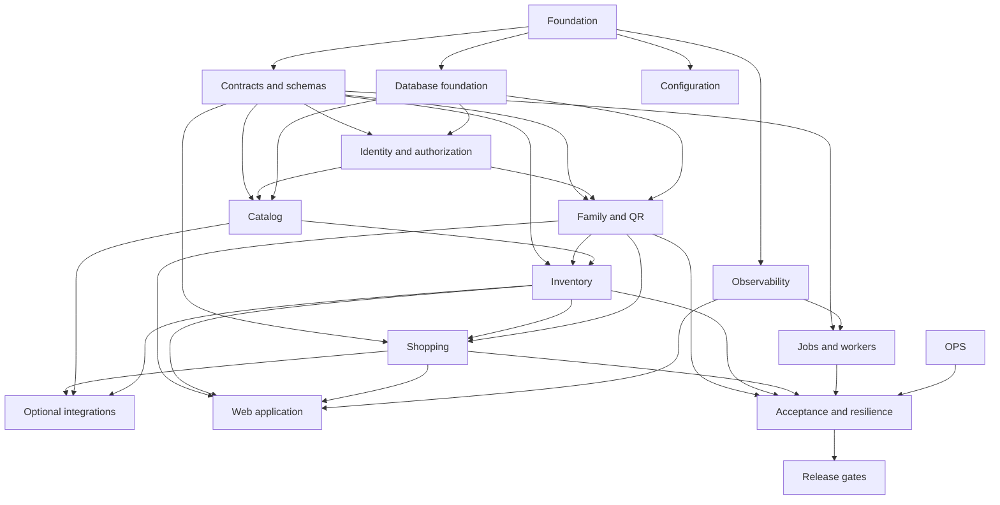

# Implementation pipeline

## 1. Purpose and authority

This document is the execution plan for implementing the platform described by the repository
contracts. It is authoritative for task order, dependencies, ownership, deliverables, and release
gates. It does not replace product, security, API, event, data, privacy, or deployment contracts;
when those documents conflict, the more specific contract wins and this plan must be updated.

The implementation target is a family-first local release with Docker Compose. Kubernetes,
retailer integrations, AI, advanced search, and non-core providers are later release stages.
No task may silently widen the scope of its work package.

## 2. Execution model

### 2.1 Work package identity

Every task has a stable ID:

`<phase>-<lane>-<number>`

Examples: `FND-PLT-001`, `DOM-FAM-004`, `REL-E2E-003`.

A task is complete only when its output exists, its declared checks pass, its ownership boundary
is respected, and its acceptance evidence is attached to the task record or pull request.

### 2.2 Agent lanes

| Lane | Exclusive ownership | Primary responsibility |
|---|---|---|
| `PLT` | root config, `tools/`, `.github/` | workspace, CI, release automation |
| `CON` | `packages/contracts/`, `docs/openapi.yaml`, `docs/EVENT-SCHEMAS.md` | wire contracts and generated types |
| `CFG` | `packages/config/` | typed configuration and profile validation |
| `OBS` | `packages/observability/`, `infra/observability/` | logs, metrics, traces, dashboards, alerts |
| `IDN` | identity and auth modules inside `apps/api`, `infra/identity/` | OIDC, principal, authorization |
| `FAM` | family modules inside `apps/api`, family migrations/tests | family, memberships, QR invites |
| `CAT` | catalog modules inside `apps/api` and integration worker | products, identifiers, provenance |
| `INV` | inventory modules inside `apps/api`, inventory worker | ledger, stock, thresholds |
| `SHP` | shopping modules inside `apps/api`, worker-core | lists, suggestions, conflicts |
| `INT` | worker-integrations modules and provider adapters | barcode, OCR, recipes, nutrition, offers |
| `JOB` | worker processes, scheduler, queue adapters | jobs, retries, DLQ, reconciliation |
| `WEB` | `apps/web/`, `packages/ui/` | PWA, routes, accessibility, offline |
| `DAT` | `infra/postgres/` | migrations, seeds, database checks |
| `OPS` | Compose/Kubernetes/deployment/runbooks | runtime, backup, restore, upgrades |
| `TST` | `packages/testkit/`, test harnesses | integration, contract, E2E, resilience |

An agent may work in one lane per task. A task requiring two lanes is split before execution.

### 2.3 File ownership rule

- A task may edit only the files listed in its work package.
- Shared files are integration-owned and cannot be edited by parallel feature agents.
- Shared integration files include root manifests, lockfiles, Compose entrypoints, OpenAPI indexes,
  generated barrels, migration registries, CI workflows, and README indexes.
- A feature agent submits an artifact plus a requested integration patch; the integration owner
  applies shared-file changes after review.
- Agents never reformat or reorganize files outside their declared ownership.
- Existing user changes are preserved; a task must stop and report a conflict instead of reverting.

## 3. Dependency graph

Parallel work is allowed only between tasks whose dependency sets are complete and whose file
ownership sets are disjoint.

## 4. Release stages

| Stage | Name | Required outcome |
|---|---|---|
| R0 | Repository foundation | reproducible workspace and CI checks |
| R1 | Runtime foundation | Compose core, PostgreSQL, Redis, config, telemetry primitives |
| R2 | Identity and family | OIDC, memberships, QR invite flow, audit |
| R3 | Catalog and inventory | products, barcode/manual entry, immutable stock ledger |
| R4 | Shopping core | reorder policy, shared lists, conflict handling |
| R5 | Usable family release | web/PWA core journeys, notifications, backup/restore |
| R6 | Hardening | security, performance, resilience, privacy and accessibility evidence |
| R7 | Optional capabilities | OCR, recipes, nutrition, offers, search projections |
| R8 | Scale release | Kubernetes overlays, multi-replica stateless services, operational proof |

R0 through R6 are required for `family-local`. R7 and R8 cannot block the family core release.

## 5. Work packages

### Phase 0: repository foundation

#### `FND-PLT-001` Freeze workspace conventions

- **Depends on:** none.
- **Owner:** `PLT`.
- **Inputs:** repository structure, Node version, package manager policy.
- **Files:** `package.json`, `package-lock.json`, `tsconfig*.json`, `.nvmrc`, `.editorconfig`,
  `.prettier*`, `eslint.config.js`.
- **Outputs:** deterministic workspace scripts for install, build, typecheck, lint, format, test.
- **Acceptance:** clean install from lockfile; all workspace scripts resolve; Node version is
  declared; no package uses a private dependency path.

#### `FND-PLT-002` Establish repository quality gates

- **Depends on:** `FND-PLT-001`.
- **Owner:** `PLT`.
- **Files:** `.github/workflows/ci.yml`, `.github/pull_request_template.md`, `CODEOWNERS`,
  `tools/validate-structure.mjs`.
- **Outputs:** CI checks for structure, build, typecheck, format, lint, unit tests and Compose.
- **Acceptance:** CI fails on a deliberately broken TypeScript file in a test branch; CI does not
  require secrets; ownership review is enforced for contracts, infrastructure and migrations.

#### `FND-PLT-003` Define service skeleton conventions

- **Depends on:** `FND-PLT-001`.
- **Owner:** `PLT`.
- **Files:** service/package manifests, service `tsconfig.json`, service README files only.
- **Outputs:** identical process layout: `src/`, `config/`, `tests/`, package manifest, build and
  typecheck scripts.
- **Acceptance:** every deployable has a manifest, typecheck command, source entrypoint, and a
  documented responsibility; no service imports another service's source directory.

#### `FND-TST-001` Create deterministic test harness baseline

- **Depends on:** `FND-PLT-001`.
- **Owner:** `TST`.
- **Files:** `packages/testkit/**` only.
- **Outputs:** clock, UUID, fixture, HTTP, database and queue test interfaces; no production
  implementation.
- **Acceptance:** deterministic IDs/time can be injected; fixtures contain no personal data; test
  package can be imported by a sample unit test.

### Phase 1: contracts, configuration and platform

#### `FND-CON-001` Materialize HTTP contract

- **Depends on:** `FND-PLT-001`.
- **Owner:** `CON`.
- **Files:** `docs/openapi.yaml`, `packages/contracts/openapi/**`, `packages/contracts/src/**`.
- **Outputs:** complete versioned OpenAPI for identity/family, catalog, inventory, shopping, jobs,
  privacy and operator routes; generated request/response types and validators.
- **Acceptance:** every endpoint in `docs/API-ENDPOINT-CATALOG.md` has a schema, auth requirement,
  errors, idempotency rule and examples; breaking changes fail compatibility check.

#### `FND-CON-002` Materialize event and job schemas

- **Depends on:** `FND-CON-001`.
- **Owner:** `CON`.
- **Files:** `packages/contracts/events/**`, `packages/contracts/jobs/**`,
  `packages/contracts/src/**`.
- **Outputs:** JSON Schemas, registry, validators and compatibility fixtures for every canonical
  event/job in `docs/CONTRACTS.md` and `docs/EVENT-SCHEMAS.md`.
- **Acceptance:** valid, missing-required, unknown-field, PII and replay fixtures exist for each
  schema; event versioning policy is executable.

#### `FND-CFG-001` Implement typed configuration

- **Depends on:** `FND-PLT-001`.
- **Owner:** `CFG`.
- **Files:** `packages/config/**`, profile fixtures only.
- **Outputs:** typed config loader, profile defaults, secret-reference validation, sanitized
  fingerprint and fail-closed validation.
- **Acceptance:** `family-local`, `test`, `staging` and `production` fixtures validate; raw secret
  values are never logged; prohibited combinations are rejected.

#### `FND-OBS-001` Implement telemetry primitives

- **Depends on:** `FND-PLT-001`.
- **Owner:** `OBS`.
- **Files:** `packages/observability/**` only.
- **Outputs:** request/job context propagation, structured redacted logger, metrics registry,
  trace helpers and health probe interfaces.
- **Acceptance:** request ID, trace ID, actor and household context propagate; secret/token/food
  payload redaction tests pass; telemetry backend failure does not fail domain requests.

#### `FND-DAT-001` Define migration runner and schema registry

- **Depends on:** `FND-PLT-001`.
- **Owner:** `DAT`.
- **Files:** `infra/postgres/migrations/**`, `infra/postgres/scripts/**`, migration docs.
- **Outputs:** external migration command, migration lock, checksum registry, expand-contract
  enforcement and rollback notes.
- **Acceptance:** migrations run once, concurrent execution is refused or serialized, checksum
  drift fails, and status is queryable.

### Phase 2: local runtime foundation

#### `RUN-OPS-001` Build Compose family-local base

- **Depends on:** `FND-CFG-001`, `FND-DAT-001`.
- **Owner:** `OPS`.
- **Files:** `docker-compose.yml`, `infra/compose/family-local.yml`, `.env.example`,
  `infra/postgres/init/**`.
- **Outputs:** API, gateway, PostgreSQL, Redis, worker-core and scheduler services with health,
  resource policy, named volumes and graceful restart.
- **Acceptance:** `docker compose --profile family-local config --quiet`; first boot initializes
  DB; core survives API restart; optional providers are absent or explicitly disabled.

#### `RUN-OPS-002` Add local identity and object storage

- **Depends on:** `RUN-OPS-001`, `FND-CFG-001`.
- **Owner:** `OPS` with `IDN`/`INT` input.
- **Files:** `infra/identity/keycloak/**`, `infra/storage/minio/**`, Compose profile fragments.
- **Outputs:** local Keycloak realm/client policy and MinIO buckets/lifecycle/bootstrap.
- **Acceptance:** OIDC discovery works locally; PKCE client is configured; bucket access is least
  privilege; credentials come only from environment; bootstrap is idempotent.

#### `RUN-OBS-001` Provision local observability

- **Depends on:** `FND-OBS-001`, `RUN-OPS-001`.
- **Owner:** `OBS`.
- **Files:** `infra/observability/**`, observability Compose profile only.
- **Outputs:** OTel Collector, Prometheus, Grafana, Alertmanager, Loki and Tempo with retention,
  dashboards and alerts-as-code.
- **Acceptance:** one synthetic request is correlated across logs/metrics/traces; critical alerts
  evaluate without Grafana; retention and redaction are verified.

### Phase 3: identity and family

#### `DOM-IDN-001` Implement OIDC principal adapter

- **Depends on:** `FND-CON-001`, `FND-CFG-001`, `RUN-OPS-002`.
- **Owner:** `IDN`.
- **Files:** identity modules inside `apps/api/src/`, identity tests only.
- **Outputs:** issuer/JWKS validation, PKCE session context, principal normalization, revocation
  handling and authentication error mapping.
- **Acceptance:** valid/expired/wrong-issuer/wrong-audience/revoked cases pass; no token is logged;
  unauthenticated requests cannot reach protected handlers.

#### `DOM-IDN-002` Implement authorization policy

- **Depends on:** `DOM-IDN-001`, `FND-CON-002`.
- **Owner:** `IDN`.
- **Files:** identity policy modules and authorization tests only.
- **Outputs:** role/policy evaluator for OWNER, MANAGER, MEMBER, VIEWER and operator scopes.
- **Acceptance:** authorization matrix tests cover allow, deny, cross-family, removed membership,
  role escalation and operator separation.

#### `DOM-FAM-001` Implement family and membership persistence

- **Depends on:** `FND-DAT-001`, `DOM-IDN-002`.
- **Owner:** `FAM`.
- **Files:** family migrations, family modules, family repositories/tests.
- **Outputs:** family creation, membership lifecycle, active-family context and unique constraints.
- **Acceptance:** creator membership is atomic; duplicate active membership is impossible; every
  mutation writes audit/outbox in the same transaction.

#### `DOM-FAM-002` Implement secure QR invitation lifecycle

- **Depends on:** `DOM-FAM-001`, `FND-CON-002`.
- **Owner:** `FAM`.
- **Files:** invite modules/tests, invite migrations only.
- **Outputs:** opaque hash-only token, expiry, one-time consumption, revoke, fallback code rate
  limit, join attempt and review/accept state machine.
- **Acceptance:** valid/expired/revoked/used/tampered/replayed flows pass; resolve reveals no
  sensitive validity detail; accept is atomic and idempotent.

#### `DOM-FAM-003` Implement family API endpoints

- **Depends on:** `DOM-FAM-001`, `DOM-FAM-002`, `FND-CON-001`.
- **Owner:** `FAM`.
- **Files:** family controller/routes, DTO adapters and endpoint tests only.
- **Outputs:** all family/invite operations from OpenAPI with stable envelopes/errors.
- **Acceptance:** contract tests pass for auth, validation, conflict, rate limit and cross-family
  denial; API documentation examples execute.

### Phase 4: catalog and inventory

#### `DOM-CAT-001` Implement product/catalog persistence

- **Depends on:** `FND-DAT-001`, `DOM-IDN-002`, `FND-CON-002`.
- **Owner:** `CAT`.
- **Files:** catalog migrations, catalog modules/repositories/tests.
- **Outputs:** product, identifier, alias, source and provenance ownership with manual precedence.
- **Acceptance:** normalized identifier uniqueness, provenance/confidence, manual-over-import
  precedence and reversible conflict handling pass.

#### `DOM-CAT-002` Implement manual and barcode catalog workflows

- **Depends on:** `DOM-CAT-001`, `FND-CON-001`.
- **Owner:** `CAT`.
- **Files:** catalog API handlers and tests only.
- **Outputs:** manual product creation, barcode normalization/lookup, candidate response and
  reviewable import command.
- **Acceptance:** known/unknown/invalid/duplicate barcode cases pass; automatic data cannot silently
  overwrite confirmed manual fields.

#### `DOM-INV-001` Implement immutable inventory ledger

- **Depends on:** `DOM-FAM-001`, `DOM-CAT-001`, `FND-DAT-001`.
- **Owner:** `INV`.
- **Files:** inventory migrations, inventory modules/repositories/tests.
- **Outputs:** stock items, lots, locations, movement ledger, quantity/unit invariants and projection.
- **Acceptance:** receipt/consumption/waste/adjustment/transfer, unit validation, negative policy,
  row locking, optimistic versioning and ledger rebuild pass.

#### `DOM-INV-002` Implement inventory API and idempotency

- **Depends on:** `DOM-INV-001`, `FND-CON-001`, `FND-OBS-001`.
- **Owner:** `INV`.
- **Files:** inventory controllers, DTOs and tests only.
- **Outputs:** stock create, movement, query, batch and correction endpoints with telemetry.
- **Acceptance:** duplicate client operation has one effect; conflicts return stable codes; every
  mutation emits the correct event and has household authorization.

### Phase 5: shopping and core workers

#### `DOM-SHP-001` Implement shopping persistence and list lifecycle

- **Depends on:** `DOM-FAM-001`, `DOM-CAT-001`, `FND-DAT-001`.
- **Owner:** `SHP`.
- **Files:** shopping migrations, modules/repositories/tests.
- **Outputs:** lists, items, source attribution, status transitions, dedupe key and versioning.
- **Acceptance:** add/update/complete/snooze/ignore/accept batch and shared edit conflict pass.

#### `DOM-SHP-002` Implement reorder policy and suggestions

- **Depends on:** `DOM-INV-001`, `DOM-SHP-001`, `FND-CON-002`.
- **Owner:** `SHP` with `JOB` integration.
- **Files:** shopping policy modules/tests; no queue implementation files.
- **Outputs:** deterministic threshold/expiry policy and idempotent suggestion command/event.
- **Acceptance:** threshold boundaries, duplicate reorder events, ignored/snoozed items and stale
  inventory projection cases pass.

#### `JOB-CORE-001` Implement queue/job infrastructure

- **Depends on:** `FND-CON-002`, `FND-CFG-001`, `FND-OBS-001`, `RUN-OPS-001`.
- **Owner:** `JOB`.
- **Files:** worker service source, queue adapters, job migrations/tests.
- **Outputs:** queues, retries/backoff/jitter, inbox dedupe, DLQ, job status, cancellation and
  graceful shutdown.
- **Acceptance:** ack follows commit, poison jobs reach DLQ, replay is audited, Redis loss is
  recoverable from PostgreSQL, backlog metrics are emitted.

#### `JOB-CORE-002` Implement worker-core handlers

- **Depends on:** `DOM-INV-002`, `DOM-SHP-002`, `JOB-CORE-001`.
- **Owner:** `JOB` with `INV`/`SHP` contract review.
- **Files:** worker-core handlers/tests only.
- **Outputs:** movement consumers, reorder consumers, reconciliation and projection rebuild jobs.
- **Acceptance:** at-least-once delivery produces one logical effect; restart/retry/replay tests
  pass; reconciliation reports drift without destructive correction.

#### `JOB-CORE-003` Implement scheduler

- **Depends on:** `JOB-CORE-001`, `DOM-INV-001`, `DOM-SHP-001`.
- **Owner:** `JOB`.
- **Files:** scheduler source/config/tests only.
- **Outputs:** expiry scan, reconciliation, retention and backup trigger schedules with DB lock.
- **Acceptance:** only one active scheduler executes a task; missed schedules recover; all runs
  have status, duration, trace and audit metadata.

### Phase 6: web, notifications and family-local release

#### `WEB-UI-001` Establish accessible UI shell

- **Depends on:** `FND-CON-001`, `FND-OBS-001`, `DOM-IDN-001`.
- **Owner:** `WEB`.
- **Files:** `apps/web/**`, `packages/ui/**` only.
- **Outputs:** Next.js app shell, OIDC callback, family context, navigation, error/loading/offline
  states, responsive layout and design tokens.
- **Acceptance:** keyboard/screen-reader smoke tests, mobile layout, no secret in browser bundle,
  telemetry context preserved, loading/error/retry states are explicit.

#### `WEB-FAM-001` Implement onboarding and QR journeys

- **Depends on:** `DOM-FAM-003`, `WEB-UI-001`.
- **Owner:** `WEB`.
- **Files:** family/onboarding routes and tests only.
- **Outputs:** create family, scan/resolve/review/accept/reject/recover invite and switch family.
- **Acceptance:** all QR state journeys and safe redirect behavior pass in Playwright.

#### `WEB-INV-001` Implement inventory journeys

- **Depends on:** `DOM-CAT-002`, `DOM-INV-002`, `WEB-UI-001`.
- **Owner:** `WEB`.
- **Files:** inventory/product routes and tests only.
- **Outputs:** manual/barcode add, stock receipt, consume, waste, correction, expiry and conflict UI.
- **Acceptance:** core actions are keyboard/touch usable; duplicate/offline/conflict/retry states
  show consequence and recovery.

#### `WEB-SHP-001` Implement shopping journeys

- **Depends on:** `DOM-SHP-001`, `DOM-SHP-002`, `WEB-UI-001`.
- **Owner:** `WEB`.
- **Files:** shopping routes/components/tests only.
- **Outputs:** active list, batch accept/reject, edit, snooze, complete, share and archive.
- **Acceptance:** ETag/version conflicts are recoverable; completion can create confirmed stock;
  list state remains household-isolated.

#### `JOB-NOT-001` Implement notification worker and preferences

- **Depends on:** `JOB-CORE-001`, `FND-CON-002`, privacy/retention contract.
- **Owner:** `JOB`.
- **Files:** worker-notifications source/config/tests, notification migrations only.
- **Outputs:** in-app delivery first, provider adapter boundary, preferences, quiet hours, opt-in,
  retry and unsubscribe.
- **Acceptance:** notification idempotency, consent, provider failure, DLQ and redacted payload
  tests pass.

#### `OPS-REL-001` Implement backup and restore automation

- **Depends on:** `RUN-OPS-001`, `DOM-FAM-001`, `JOB-CORE-001`.
- **Owner:** `OPS`.
- **Files:** backup scripts, Compose ops files, runbook updates, restore tests.
- **Outputs:** PostgreSQL and MinIO backup, encryption/reference policy, verification and restore
  drill automation.
- **Acceptance:** restore produces a usable isolated environment; backup age alert works; no secret
  or personal data is written to unprotected logs.

### Phase 7: hardening and release evidence

#### `REL-TST-001` Build contract and integration suite

- **Depends on:** R2-R5 contracts and services.
- **Owner:** `TST`.
- **Files:** `packages/testkit/**`, test harness directories, no feature source.
- **Outputs:** API/event contract tests, PostgreSQL/Redis integration tests, authz matrix suite.
- **Acceptance:** all public endpoints cover success, validation, unauthorized, forbidden, not
  found, conflict, rate-limit and dependency failure cases.

#### `REL-TST-002` Build family-local E2E suite

- **Depends on:** `WEB-FAM-001`, `WEB-INV-001`, `WEB-SHP-001`, `RUN-OBS-001`, `OPS-REL-001`.
- **Owner:** `TST`.
- **Files:** E2E test project and fixtures only.
- **Outputs:** first-run, QR join, product add, receipt, consumption, reorder, shared shopping,
  backup/restore and telemetry journey.
- **Acceptance:** clean Compose boot, health/readiness, trace correlation and restore evidence all
  pass from a synthetic dataset.

#### `REL-SEC-001` Execute security gates

- **Depends on:** `REL-TST-001`.
- **Owner:** `TST` with `IDN`/`OPS`.
- **Files:** security test config, reports, threat-model updates only.
- **Outputs:** SAST, dependency, secret, container, DAST, upload, SSRF, CSRF, XSS, rate-limit and
  authorization evidence.
- **Acceptance:** no unresolved critical/high findings; exceptions have owner, expiry and rationale.

#### `REL-OPS-001` Execute resilience and SLO evidence

- **Depends on:** `REL-TST-002`, `RUN-OBS-001`, `OPS-REL-001`.
- **Owner:** `OPS`.
- **Files:** load/resilience tests, alert rules, runbooks, release evidence.
- **Outputs:** p95 measurements, restart/retry/DLQ/Redis-loss/telemetry-loss/disc-full drills,
  restore RTO/RPO evidence and error budget report.
- **Acceptance:** family-local SLOs are met or explicitly waived; every alert has owner, query and
  runbook; no claimed HA on a single host.

#### `REL-GOV-001` Complete privacy and documentation gate

- **Depends on:** `REL-SEC-001`, `REL-OPS-001`.
- **Owner:** `PLT` with product/privacy/security reviewers.
- **Files:** traceability, readiness audit, retention/privacy docs, release checklist only.
- **Outputs:** requirement-to-test traceability, data lifecycle review, known-risk register and
  release approval record.
- **Acceptance:** every MUST requirement is mapped to implementation and evidence; unresolved
  items are explicitly out of release scope with owner and follow-up release.

### Phase 8: optional capabilities

#### `OPT-INT-001` Barcode/catalog external adapters

- **Depends on:** `DOM-CAT-002`, `JOB-CORE-001`, provider matrix.
- **Owner:** `INT`.
- **Files:** worker-integrations barcode adapter and contract tests only.
- **Outputs:** timeout, rate-limit, schema-version, provenance and fallback behavior.
- **Acceptance:** provider outage leaves manual flow usable; imported fields remain reviewable.

#### `OPT-INT-002` OCR/photo recognition pipeline

- **Depends on:** `OPT-INT-001`, MinIO, media retention policy.
- **Owner:** `INT`.
- **Files:** recognition modules, media pipeline, schemas/tests only.
- **Outputs:** upload validation, antivirus boundary, EXIF handling, OCR candidate job and review.
- **Acceptance:** malware/unsupported/large/low-confidence/provider-timeout cases are safe and
  recoverable; no automatic low-confidence mutation.

#### `OPT-INT-003` Recipes and nutrition

- **Depends on:** catalog, inventory read model, source policy, `JOB-CORE-001`.
- **Owner:** `INT`.
- **Files:** recipes/nutrition modules, schemas/tests only.
- **Outputs:** explainable ranking, allergen hard constraints, source quality, serving calculations,
  estimated-versus-confirmed distinction.
- **Acceptance:** allergen violation target is zero; AI/provider output is labeled and never treated
  as medical advice or verified nutrition without source.

#### `OPT-INT-004` Offers and retailer adapters

- **Depends on:** catalog, shopping, provider matrix, legal/source approval.
- **Owner:** `INT`.
- **Files:** offers adapters/modules/tests only.
- **Outputs:** authorized source imports, freshness, area/store conditions, stale suppression.
- **Acceptance:** source terms and rate limits are enforced; stale/unverified offers are not shown
  as active; no retailer dependency blocks core shopping.

#### `OPT-SEARCH-001` Search projection

- **Depends on:** catalog/inventory/shopping events, `JOB-CORE-001`.
- **Owner:** `JOB`/`INT`.
- **Files:** search-indexer source/config/tests and optional infrastructure only.
- **Outputs:** rebuildable PostgreSQL search first; OpenSearch adapter only after benchmark evidence.
- **Acceptance:** projection lag is measurable, replay rebuilds identical results, fallback works,
  household isolation remains enforced.

### Phase 9: scale release

#### `SCL-OPS-001` Kubernetes base and overlays

- **Depends on:** family-local release evidence.
- **Owner:** `OPS`.
- **Files:** `infra/kubernetes/**` only.
- **Outputs:** Deployments for stateless services, Stateful/external state policy, probes, resources,
  network policies, secrets references, ingress and PodDisruptionBudgets.
- **Acceptance:** manifests render; no plaintext secrets; resource limits match documented budgets;
  core remains deployable without optional capabilities.

#### `SCL-OPS-002` Stateless scaling and queue autoscaling

- **Depends on:** `SCL-OPS-001`, `REL-OPS-001`, worker backlog metrics.
- **Owner:** `OPS`.
- **Files:** Kubernetes autoscaling/policy files and capacity evidence only.
- **Outputs:** API and worker scaling policy based on latency/backlog, with hysteresis and limits.
- **Acceptance:** load test demonstrates scaling without duplicate side effects or household
  isolation regressions.

#### `SCL-REL-001` Production readiness gate

- **Depends on:** all R8 tasks.
- **Owner:** `PLT`/`OPS`.
- **Files:** release evidence and readiness docs only.
- **Outputs:** multi-node restore, secret rotation, TLS/DNS, artifact signing, SBOM, disaster
  recovery and operator handoff evidence.
- **Acceptance:** all production prerequisites in `docs/DEPLOYMENT-CONTRACT.md` are evidenced or
  explicitly waived by an accountable owner.

## 6. Parallel execution waves

| Wave | Can run in parallel | Exit condition |
|---|---|---|
| W0 | `FND-PLT-001` | workspace installs |
| W1 | `FND-PLT-002`, `FND-PLT-003`, `FND-TST-001` | CI and skeleton conventions exist |
| W2 | `FND-CON-001`, `FND-CFG-001`, `FND-OBS-001`, `FND-DAT-001` | contracts/config/platform interfaces frozen |
| W3 | `FND-CON-002`, `RUN-OPS-001` | schema registry and core Compose render |
| W4 | `RUN-OPS-002`, `RUN-OBS-001`, `DOM-IDN-001` | local dependencies and auth context work |
| W5 | `DOM-IDN-002`, `DOM-FAM-001`, `DOM-CAT-001` | authorization, family and catalog persistence work |
| W6 | `DOM-FAM-002`, `DOM-CAT-002`, `DOM-INV-001` | family invites, catalog entry and ledger work |
| W7 | `DOM-FAM-003`, `DOM-INV-002`, `DOM-SHP-001` | public family/inventory/shopping foundations work |
| W8 | `DOM-SHP-002`, `JOB-CORE-001`, `WEB-UI-001` | reorder, jobs and UI shell work |
| W9 | `JOB-CORE-002`, `JOB-CORE-003`, `WEB-FAM-001`, `WEB-INV-001`, `WEB-SHP-001` | family journeys work |
| W10 | `JOB-NOT-001`, `OPS-REL-001`, `REL-TST-001` | operational core and contracts verified |
| W11 | `REL-TST-002`, `REL-SEC-001`, `REL-OPS-001` | release evidence exists |
| W12 | `REL-GOV-001` | family-local release approved |
| W13 | optional capability tasks | optional feature releases independently |
| W14 | scale tasks | production readiness approved |

## 7. Definition of done for every task

A task is not done when code compiles. The agent must provide:

1. changed-file manifest matching the work package;
2. input contracts consumed and versions used;
3. output artifacts and public symbols/endpoints/events added;
4. tests and exact commands run;
5. migration, config, telemetry, authorization, privacy and degraded-mode impact;
6. known limitations and follow-up task IDs;
7. no edits to another lane's files;
8. no untracked generated files, secrets, fixtures with personal data, or unrelated formatting.

## 8. Integration order

1. Contract owner merges schemas and generated types.
2. Database owner merges migrations and migration checks.
3. Configuration/observability owners merge shared interfaces.
4. Domain owners merge implementation against frozen contracts.
5. Worker owner wires events/jobs after producer and consumer tests exist.
6. Web owner integrates only through public API/client contracts.
7. Operations owner updates deployment and runbooks after health/config interfaces stabilize.
8. Test owner adds cross-boundary suites after individual lanes publish evidence.
9. Release owner updates traceability/readiness only after test and operational evidence exists.

No agent may bypass this order by editing another lane's source or by coupling directly to a
private database table.

## 9. Conflict and failure protocol

- If a required file is already modified by another task, stop and report the exact path and
  conflicting intent.
- If a contract is insufficient, create a contract gap report; do not invent a private payload.
- If a dependency is unavailable, implement the adapter boundary and a deterministic failure test;
  do not add a hidden mock provider to production paths.
- If a test exposes a cross-lane defect, the discovering agent owns the reproduction; the owning
  lane owns the fix.
- If an acceptance criterion cannot be verified locally, mark the task `BLOCKED`, state the
  missing prerequisite, and do not claim completion.
- Never reset, revert, or overwrite work from another agent.

## 10. Release gate checklist

### Family-local gate

- [ ] clean install from lockfile;
- [ ] structure, build, typecheck, lint, format and unit tests pass;
- [ ] Compose profile renders and all core health/readiness probes pass;
- [ ] OIDC, family creation and QR join evidence exists;
- [ ] catalog/manual/barcode, inventory ledger and shopping journeys pass;
- [ ] outbox/inbox, retries, DLQ and reconciliation evidence exists;
- [ ] household isolation and authorization matrix pass;
- [ ] backup and restore drill passes;
- [ ] dashboards, metrics, traces, alerts and runbooks are linked;
- [ ] security, privacy, accessibility and release traceability gates pass.

### Production gate

- [ ] multi-node topology tested;
- [ ] stateless scaling and worker autoscaling measured;
- [ ] stateful replication/managed services and restore tested;
- [ ] secrets, TLS, artifact signing and SBOM verified;
- [ ] capacity, cost, SLO and error-budget review approved;
- [ ] operator ownership and incident response confirmed.
