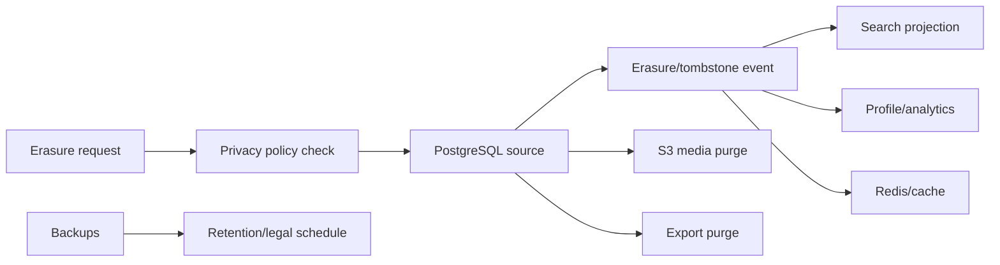

# Retention e ciclo di vita dei dati

## 1. Regole generali

La retention dipende da finalita, consenso, sicurezza e obblighi. Non si conserva un dato solo perche lo storage e economico. Ogni cancellazione deve propagare a cache, proiezioni, indici, analytics e backup secondo la policy dichiarata.

## 2. Matrice iniziale

| Dato | Finalita | Retention operativa | Cancellazione |
|---|---|---:|---|
| session metadata | sicurezza/sessione | 30 giorni dopo revoca | purge giornaliero |
| family membership | servizio/audit | durata rapporto + policy audit | revoke/anonymize |
| QR token hash | join/anti-abuse | fino a expiry/revoke + 30 giorni | purge |
| join attempt | join flow | 30 minuti | purge |
| stock movements | ledger servizio | durata account + obbligo audit | anonymize se necessario |
| shopping lists | storico personale | configurabile, default 24 mesi | user archive/delete |
| raw foto OCR | riconoscimento | fino a review + 7 giorni | purge automatico |
| product provenance | qualita catalogo | finche prodotto/source attivi | version/tombstone |
| nutrition data | servizio | fonte valida + version history | replace/tombstone |
| offers | informazione temporale | 90 giorni dopo validita | purge/archive aggregate |
| jobs | operativita | 90 giorni | purge, metriche aggregate |
| DLQ payload | recovery | 30 giorni o retention incident | purge dopo replay/audit |
| application logs | troubleshooting | 14-30 giorni | lifecycle storage |
| security audit | sicurezza/compliance | da definire con DPO/legal | append-only retention |
| traces | troubleshooting | 7-14 giorni | lifecycle storage |
| metrics | SLO/trend | 30-180 giorni | downsample/archive |
| profile features | personalizzazione opt-in | TTL per feature, max 90 giorni default | tombstone su revoca |
| exports | diritto accesso | 7 giorni | secure purge |
| backups | recovery | 7/30/365 secondo policy | lifecycle cifrato |

I tempi sono valori iniziali e richiedono approvazione privacy/legal.

## 3. Stati di cancellazione

```text
ACTIVE -> ARCHIVED -> ERASURE_REQUESTED -> ERASING -> ERASED
                                      \-> BLOCKED (legal hold/incident)
```

Il ledger non viene riscritto per cancellare la storia: si applicano anonimizzazione, tombstone e policy di audit. L'utente deve ricevere stato e risultato della richiesta di cancellazione.

## 4. Propagazione erasure



Backup non vengono modificati live se la tecnologia non lo consente: la cancellazione viene documentata, impedisce il restore non conforme senza nuova erasure e scade secondo retention.

## 5. Accesso e audit

- accesso per finalita e ruolo;
- export e cancellazione auditati;
- operatori non possono cancellare audit ordinario;
- retention job produce metriche e alert se fallisce;
- ogni purge e idempotente e rieseguibile;
- data classification accompagna schema, evento e projection.

## 6. REL-GOV-001 review

La retention iniziale è una policy di design e richiede approvazione privacy/legal prima della
beta. Export, erasure, audit e backup hanno owner e propagazione documentati; nessun dato viene
considerato cancellato solo perché è stato rimosso dalla tabella autorevole. Le richieste non
implementate sono tracciate in [TRACEABILITY.md](TRACEABILITY.md) e bloccano l'approvazione di
release.
